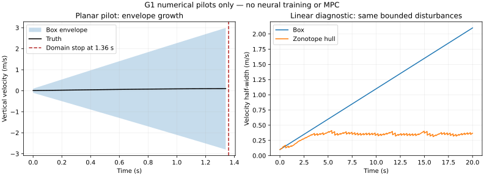

# 08 G1 实现、实际验证与研究路线修正

日期：2026-09-09。继承方案提交 `1323ab4e1315f112018561d1e502c987e48386bb`。本轮完成可运行的 G1 数值原型；**G2 的可用滤波基线尚未通过，暂停神经训练和 MPC 实现**。没有使用用户过去的 Transformer/扰动集合路线。

## 1. 本次新增的可运行模块

| 文件 | 实际职责 | 边界 |
|---|---|---|
| `src/smf_mpc/plant.py` | 01 的离散平面真值、解析气动残差、带噪观测生成 | 仅离线 runner 可调用，在线滤波不导入它 |
| `src/smf_mpc/sensing.py` | 观测对象、逐 tick 包调度、所有相位/先前丢包计数下合法短窗口枚举 | 支持零延迟；过合同抛异常 |
| `src/smf_mpc/sets.py` | box、三角函数区间极值、普通 zonotope 线性传播/条带更新/降阶 | float64 数值外包；未认证舍入误差 |
| `src/smf_mpc/filter.py` | 零学习残差预测器、全域解析残差幅值界、因果 box SMF | 仅已知解析基准，未训练网络，未实现非线性 zonotope |
| `src/smf_mpc/data.py` | 独立随机子流、轨迹级 split、先划分后切窗口的索引 | 不是已生成的正式训练集 |
| `scripts/run_g1.py` | 三个 pilot 种子×三个位置丢包工况；线性集合对照；完整数值日志与哈希 | 只消费 70001–70003，不读取正式测试集 |
| `tests/test_g1.py` | 17 项性质、边界和负例检查 | 通过不等于全域或控制保证 |
| `scripts/plot_g1.py` | 从 CSV 生成可复现 SVG 科研图 | 不由手工绘图编造曲线 |

## 2. 在仓库根目录复现

```bash
python -m pip install -r verification/requirements.txt
python -m unittest discover -s tests -v
python scripts/run_g1.py --output results/my_g1_run
```

输出目录必须不存在或为空，防止覆盖已有结果。脚本根据自身路径加载 `src`，Windows/Linux 均无需设置 PYTHONPATH。测试环境：Python 3.12.13、NumPy 2.3.5、SciPy 1.17.0。可选画图：

```bash
python -m pip install matplotlib==3.10.8
python scripts/plot_g1.py results/my_g1_run
```

本次实际输出见 [summary.json](../../results/g1_20260909/summary.json)、[manifest.json](../../results/g1_20260909/manifest.json)、[测试日志](../../results/g1_20260909/tests.txt)。完整逐步数据为 [平面 CSV](../../results/g1_20260909/planar_steps.csv) 与 [线性 CSV](../../results/g1_20260909/linear_steps.csv)。[窗口索引](../../results/g1_20260909/window_index.json) 是可再生 pilot 轨迹的元数据，不是可直接训练的残差标签数据集。



## 3. 本轮真值、输入和数据合同

保持 01 的模型及默认配置，风真值固定为零，外部过程噪声为零；滤波仍需覆盖声明风域 `[-0.5,0.5]^2` 和全部状态输入域。初始真值先在配置 prior 内采样，再把初始速度乘 0.4，俯仰/角速率置零；这只是悬停附近机制 pilot，不代表完整初始域评估。

施加不读取任何状态的固定时间信号：

$$T_k=mg[1+0.01\cos(kh)],\qquad \tau_k=0.$$

每条真值轨迹生成 20 秒，步长 0.02 秒；S0 正常收包，S1 收一包/丢一包，S2 收一包/连续丢两包。三种测量工况共享完整真值、输入和潜在观测噪声，再根据各自 mask 隐藏观测。故这是固定输入重放，不是闭环控制。

初次技术预演采用较大的初始速度和正弦推力，发现部分真值在 20 秒后离域；为隔离“外包络膨胀”机制，改为上面的近悬停轨迹，并重新生成本次归档。该变更发生在 pilot，未触及正式测试种子；不将预演调参描述成预注册实验。最终全部真值轨迹 20 秒内均在工作域。

`manifest.json` 绑定配置、实际源码和核心结果文件 SHA256。原始完整真值/潜在测量数组由固定种子重新生成，保存其联合哈希；CSV 保存实际滤波有效段及终止事件。不能将停止后的未计算滤波值补作成功样本。

## 4. 本次残差包络如何得到

预测器只使用名义物理模型，网络残差为零。设

$$R_x=\max |v_x-b_x|=3.5,\quad R_z=3.5,\quad q_T=\max |T/(mg)-1|=0.5.$$

由三角不等式以及 $|\sin|,|\cos|\le1$：

$$|a_{*,x}|\le0.12 R_x\sqrt{R_x^2+0.04}+0.03R_xR_z+0.08q_T,$$

$$|a_{*,z}|\le0.15 R_z\sqrt{R_z^2+0.04}+0.02R_x^2.$$

乘 h=0.02 后，速度分量每步残差半径分别约为 **0.037598、0.041710 m/s**。这是以 01 已知解析系数为前提、实数算术中的保守界；当前 NumPy/libm 计算及工程裕量 `1e-12*(1+abs(bound))` 没有严格舍入证书。状态标签为 `FLOAT64_ENGINEERING_MARGIN_NOT_CERTIFIED`，不能升级为 CERTIFIED_ANALYTIC。

这不使用测试残差最大值，也没有把真值当前风或当前状态传给滤波器。它同时非常保守，适合作为明确失败的基线，不适合直接当作可用学习控制方案。

## 5. 实际结果：平面基线没有通过可用性门

| 实验 | 条数 | 有效段成员漏出 | 停止原因 | 停止时间 |
|---|---:|---:|---|---:|
| S0 正常位置测量 | 3 | 0 | 后验外包络超工作域 | 1.36 s |
| S1 连续丢 1 包 | 3 | 0 | 后验外包络超工作域 | 1.36 s |
| S2 连续丢 2 包 | 3 | 0 | 后验外包络超工作域 | 1.36 s |

无容差成员检查与 1e-10 容差检查均未在有效段发现漏出。每条有效段包含 tick 0–67，tick 68 拒绝继续；失败行不记录旧集合冒充新后验。停止表示无法继续使用当前工作域上的误差界，不表示真值坠毁。三个 seed 的完整 20 秒真值轨迹均在域内。

因此可以报告“包含性质的有限反例搜索未发现错误”，不能报告“滤波器稳定”“可运行 20 秒”或“能容忍两包丢失”。零次漏出只覆盖实际检查的时刻，不覆盖提前停止后的滤波行为。

## 6. 可以手工推导的结构限制

对本轮 box 预测器，速度半径满足

$$r_{v,j,k+1}^{-}=r_{v,j,k}+h\,r_{f,j,k}+\bar w_{v,j},\quad r_{f,j,k}\ge0.$$

位置、角度和角速率的逐坐标测量交集不改变速度分量，所以

$$r_{v,j,k+1}^{+}=r_{v,j,k+1}^{-}\ge r_{v,j,k}+\bar w_{v,j},$$

进而在可持续定义的递推中 $r_{v,j,k}\ge r_{v,j,0}+k\bar w_{v,j}$。只要每步采用严格正的固定残差半径，速度宽度就不能在这种实现中保持有界。有限域实现会先触发 OUT_OF_DOMAIN。

这个结论针对**把运动学增量/残差范围分别做 Minkowski 相加，再只作坐标交集**的 box 算法；不是所有区间滤波的不可能性定理，更不是对 SMF 的否定。整体均值形式、保留依赖的仿射表达、状态相关误差界或耦合测量反演可以改变递推。不能把本结论扩展到所有网络结构和所有集合算法。

尤其需要注意：仅仅给该自然区间传播器添加神经网络，再优化后验宽度，并不会自动解决未观测速度缺乏收缩的问题。训练可能降低有限域宽度，但长时可用性必须单独解决。

## 7. 线性相关性对照及其限制

独立两维系统：$x=[p,v]^T$，$A=[[1,h],[0,1]]$，过程增量界 $[10^{-5},0.002]^T$，位置测量误差界 0.02，初始半径 $[0.02,0.1]^T$。真值用该界内确定性正弦/余弦过程扰动；两种估计器共享观测。zonotope 使用 02 的 F5/F6，最多 20 个生成元，丢弃部分用对角 box 外包。

| 20 秒时速度半径 (m/s) | S0 | S1 | S2 |
|---|---:|---:|---:|
| box | 2.1000 | 2.1000 | 2.1000 |
| zonotope 的轴向包络 | 0.3827 | 0.3331 | 0.3681 |

三种工况各 1001 时刻均进行了普通 zonotope 数值 LP 成员见证检查；等式残差及生成系数界容差为 1e-8，未发现成员失败。它比仅检查 zonotope 的 bounding box 更强，但仍不是严格精确算术证书。

S1 最终包络比 S0 小，不表示丢包有益。Frobenius 增益、外包和生成元降阶改变几何保守性，当前实现不保证测量越多则每个轴向宽度越小。该反常排序须保留并解释；后续需以精确条带交集/更高生成元预算定位松弛来源，不能择优删去 S0。

线性对照说明“保留相关性值得继续实现”，不能证明非线性四旋翼 zonotope 稳定，更不能代替神经训练 C/D 的消融。

## 8. 测试范围与下一步决策

17 项检查涵盖：悬停/力矩符号、box 极点映射、三角区间内极值、空集和不变对象、速度不被坐标测量伪收缩、全域残差界边界与随机样本、1000 个独立真值单步包含、域外拒绝、真实包时序、第三次丢包拒绝、全部起始相位的短时模式穷举、未来时间戳/非法通道拒绝、在线真值隔离、zonotope LP 成员及降阶支持函数、轨迹级数据隔离。记录见测试日志。独立重复运行后，两份 CSV、窗口索引、summary 和 manifest 共 5 个核心文件逐字节一致。

下一次实现应按顺序完成：

1. 用 02 的 F3/F4 实现**非线性 zonotope 预测器**；先使用名义物理 Jacobian 和全域已知残差，不引入训练。推力方向的 Hessian 余项必须覆盖整集合。
2. 重放本次完全相同的三种日志，对比成员包含、域有效时长、轴向宽度、生成元预算、真实耗时；保留本次 box 失败基线。
3. 若仍过度膨胀，分开检查全域残差界、线性化余项、测量外包和降阶四项贡献。只能通过有依据的局部域包络/更紧差函数认证减小误差界，不允许人为缩界。
4. 至少获得可重复的 20 秒域内估计原型后，才确定 A/B/C/D 的共同集合表示；必要时修订 02 的训练代理。训练时 box、评价时 zonotope 仍可作消融，但必须量化代理与评价差异。
5. 然后进入 G2 的网络 A 与逐模型认证。当前 K、L 模式族和终端证书仍为空；本轮未声称完成 G4。

这是依据真实实现得到的路线修正；它提高后续训练的可解释性，也允许最终否证原候选机制。
