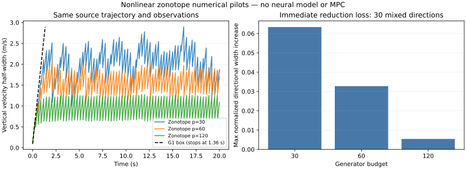

# 09 非线性 zonotope 滤波实现与配对验证

> 后续进展：模型 A 已训练并接入集合传播；学习模型的包络/余项导致可用性失败，最新结果见 [10](10_model_a_training_and_envelope.md)。本章保留物理 zonotope 的历史验证。

日期：2026-09-09。本轮实现的是零学习残差的物理预测器＋非线性余项＋全域解析残差界＋zonotope 测量更新。没有神经网络、MPC 或新稳定性定理。使用与 G1 完全相同的 pilot 真值、实际输入和潜在测量噪声，通过原始数组联合 SHA256 逐条核对。

## 1. 当前代码与复现

- `src/smf_mpc/zonotope_filter.py`：名义映射及 Jacobian、整集合余项、非线性预测、观测一致性 LP、条带外包和域检查。
- `scripts/run_zonotope.py`：三个 seed × 三种测量工况 × 30/60/120 个生成元预算，共 27 条 20 秒重放。
- `tests/test_nonlinear_zonotope.py`：9 项新检查，包括一次实际发生的 LP 容差回归案例；连同 G1 共 26 项。
- `scripts/plot_zonotope.py`：从归档压缩 CSV 生成科研图。

在仓库根目录运行：

```bash
python -m pip install -r verification/requirements.txt
python -m unittest discover -s tests -v
python scripts/run_zonotope.py --output results/my_zonotope_run
```

输出目录须为空，可用 `--budgets 30` 仅运行默认预算的九条轨迹。本次 Linux 运行设置 `OPENBLAS_NUM_THREADS=1`、`OMP_NUM_THREADS=1`；环境和平台见 manifest。未将该设置当作对全部求解器内部线程的证明。

可选画图，Matplotlib 3.10.8：

```bash
python scripts/plot_zonotope.py results/my_zonotope_run
```

完整日志以 `steps.csv.gz` 保存，可直接解压为 CSV；它包含每一步成员状态和位置/速度半径。计时统计单列在 summary，绘图和离线真值成员检查不计入滤波耗时。

## 2. 实际使用的非线性余项

对于 01 的名义映射 $`F_0=x+h f_c^0`$，固定实际输入 $`u=[T,\tau]^T`$，以 $`c`$ 为展开中心，$`A_c=\partial F_0/\partial x(c,u)`$：

```math
F_0(x,u)=F_0(c,u)+A_c(x-c)+r_{\rm nl}(x).
```

非零二阶导数只有两个速度输出的俯仰二阶导数（数学索引从 1 开始）：

```math
\frac{\partial^2 F_{0,3}}{\partial\phi^2}
=\frac{hT}{m}\sin\phi,
\qquad
\frac{\partial^2 F_{0,4}}{\partial\phi^2}
=-\frac{hT}{m}\cos\phi.
```

令 $`r_\phi=\sum_j|G_{5,j}|`$，区间 $`I_\phi=[c_5-r_\phi,c_5+r_\phi]`$，取包含区间内极值的三角函数界：

```math
\bar r_{{\rm nl},3}
=\frac{hT}{2m}\max_{\phi\in I_\phi}|\sin\phi|\,r_\phi^2,
\qquad
\bar r_{{\rm nl},4}
=\frac{hT}{2m}\max_{\phi\in I_\phi}|\cos\phi|\,r_\phi^2.
```

其他分量余项为零。这里 T 非负，质量为正；该公式仅适用于当前固定输入的名义物理映射。加入神经模型或把输入也作为不确定变量后，必须重新加入对应 Hessian 项，不能沿用本界。

预测集合为：

```math
Z_{k+1}^{-}=Z\left(
F_0(c_k,u_k),
\left[A_{c_k}G_k,\;
\operatorname{diag}(\bar w+\bar r_{\rm nl}+\varepsilon_{\rm num})\right]
\right).
```

$`\bar w`$ 沿用 G1 的同一全域解析残差界，未因试验结果人为缩小。$`\varepsilon_{\rm num}`$ 是工程数值裕量，不是经证明的浮点舍入证书；全部结果仍标为 `FLOAT64_ENGINEERING_MARGIN_NOT_CERTIFIED`。

## 3. 测量一致性、更新和原子失败

更新前求解：

```math
[CG^{-},V]\begin{bmatrix}\xi\\\zeta\end{bmatrix}=y-Cc^{-},
\qquad -\mathbf 1\le\begin{bmatrix}\xi\\\zeta\end{bmatrix}\le\mathbf 1.
```

该可行性问题用于检测观测条带是否与预测集合相交。通过后采用 02 的 F5/F6 外包更新，再按生成元预算降阶。LP 报不可行时记录数值 EMPTY_SET；其他求解失败及见证残差不合格记录 NumericalFailure。任何一种失败均不执行隐式噪声膨胀或截断集合。

滤波继续沿用 G1 的时间戳、通道、测量噪声界和最大丢包数检查；滤波函数只接收实际施加输入和当前观测，不接收真值。新集合、tick 和丢包计数在全部检查通过后才提交；失败保留上一个有效状态。

对整个预测映射的求值域检查使用旧 zonotope 的轴向外包箱；每次测量更新/降阶后也检查后验外包箱是否仍在工作域。不会把越域集合裁剪回任务约束箱来制造包含性。

在线增益为 F6 的动态几何增益。03 的 V1 固定增益观测器/误差管公式不能直接套用本实现；控制阶段须固定增益或显式覆盖增益变化。

## 4. 本次实际修复的数值问题

首次默认预算预演在 seed 70003、S0、tick 164 出现验证失败：HiGHS 默认容差返回“成功”，但该见证等式残差约 $`1.668493\times10^{-8}`$，超过本项目 $`10^{-8}`$ 检查阈值。不能将其直接称作真值漏出。

修复采用更严格的 LP 求解设置：primal/dual feasibility tolerance 为 $`10^{-9}`$；见证检查仍为 $`10^{-8}`$。没有放宽验收阈值。保留触发问题的矩阵与右端项为 `tests/fixtures/lp_tolerance_case.json`，并加入回归测试。离线成员评估也将数值失败和判为不可行的成员失败分别记录。

120 个生成元预算的预演进一步发现，物理单位和小生成元引起的行尺度差异仍可造成同类残差失败。采用等价的正行缩放：

```math
s_i=\max\{\max_j |A_{ij}|,|b_i|,10^{-12}\},
\qquad \widetilde A_{ij}=A_{ij}/s_i,\quad \widetilde b_i=b_i/s_i.
```

对 $`A\xi=b`$ 与缩放后系统，可行系数集合相同。求解后仍在原始 A/b 上检查残差和系数界。对应案例从约 $`1.65\times10^{-8}`$ 降到 $`10^{-12}`$ 量级；新增 `lp_row_scaling_case.json` 回归数据。最终归档由修复后源码重新运行生成，未将预演中的数值失败算作有效完成。

## 5. 怎样解释生成元降阶诊断

使用对角箱外包 dropped 生成元时，**当前各坐标半径可保持不变**，所以只看轴向宽度增量不能测出相关性损失。

本轮另外固定 30 个混合方向。设状态尺度 $`s`$ 与 02 一致，$`e_i`$ 为标准基向量：

```math
a_{ij}^{\pm}=\frac{e_i/s_i\pm e_j/s_j}{\sqrt 2},\quad i<j.
```

降阶前后中心不变，记录最大方向宽度增加：

```math
\Delta_{\rm red}
=\max_{i<j,\,\pm}2\left(
\|(G_{\rm after})^T a_{ij}^{\pm}\|_1
-\|(G_{\rm before})^T a_{ij}^{\pm}\|_1
\right).
```

这是有限方向的局部几何诊断，不是体积损失或未来保守性的完整度量。与此同时，summary 保存线性传播、模型残差、非线性余项及测量后半径的各分量最大值；这些最大值可能来自不同时刻，不能简单相加解释某个时刻的宽度。

## 6. 实际运行结果

[结果汇总](../../results/nonlinear_zonotope_20260909/summary.json)、[完整逐步压缩 CSV](../../results/nonlinear_zonotope_20260909/steps.csv.gz)、[环境与哈希](../../results/nonlinear_zonotope_20260909/manifest.json)、[26 项测试日志](../../results/nonlinear_zonotope_20260909/tests.txt)。

三种生成元预算均完成九条轨迹的 20 秒重放。共 27,027 个初始/后验时刻的普通 zonotope 数值 LP 成员检查通过；所有源轨迹哈希与 G1 一致。全部有效后验外包箱在声明工作域内，未出现 EMPTY_SET、域外终止或数值验证失败。这里的 COMPLETED 仅指估计重放完成，不包含控制任务成功或实时截止条件。

| 生成元预算 | 完成 20 s | 全部轨迹/时刻最大水平速度半径 | 最大竖直速度半径 | 最大混合方向降阶宽度增加 |
|---|---:|---:|---:|---:|
| 30 | 9/9 | 2.8629 m/s | 2.8969 m/s | 0.063337 |
| 60 | 9/9 | 1.8959 m/s | 2.0471 m/s | 0.032772 |
| 120 | 9/9 | 1.2241 m/s | 1.2767 m/s | 0.005446 |

G1 box 在相同输入、观测和误差界条件下于 1.36 秒停止。本轮改变集合表示和更新方法后完成 20 秒，支持“相关性保留能改善这个基准的可用性”，不能据此声称一般非线性稳定性。

即使默认预算 30 能完成重放，其最大速度半径已接近 ±3 m/s 工作域边界，裕量有限。更大预算改善本次观测到的保守性，但不能据此假定任何预算增加都单调改善所有方向或所有工况。



## 7. 耗时结果与当前门槛

| 生成元预算 | 九条轨迹中最大的单轨迹 p99 | 全部调用最大值 | 超过 20 ms 的调用数/9000 |
|---|---:|---:|---:|
| 30 | 17.167 ms | 165.071 ms | 34/9000 |
| 60 | 26.298 ms | 191.971 ms | 51/9000 |
| 120 | 15.181 ms | 172.408 ms | 29/9000 |

计时包括滤波 advance 内部的观测一致性 LP、几何增益、传播、降阶和域检查；不包括离线真值 LP 成员评价、日志、真值生成，也不包括尚未实现的 MPC。没有剔除预热或异常耗时；共享运行环境的这些结果不能代表部署平台的确定性延迟。120 预算的 p99 小于 60 预算不构成复杂度优势，计时存在系统调度波动。

总计 114 次超过 20 ms，且最大值远超周期；**实时门尚未通过**。本轮没有执行截止时间下的控制或后备策略，因此不能将这些重放记为“实时闭环成功”。后续在固定目标 CPU 上单独分析 LP、集合运算和调度开销，再复测尾延迟。

## 8. 保守性诊断与下一步

模型残差对竖直速度的每步半径仍约为 0.04171 m/s；本轮所有预算下观察到的最大非线性竖直余项半径小于 0.000006 m/s。这说明在当前近悬停 pilot 上，直接注入的模型残差远大于名义非线性余项。它只是局部实验诊断，不能推断激烈姿态运动时仍相同。

下一步应完成：

1. 保留本轮 30/60/120 预算结果，先比较计算预算与估计裕量，再冻结学习实验的集合表示；30 预算接近边界，不自动选为部署配置。
2. 构建训练/验证轨迹与点预测模型 A，并对该模型重新计算完整物理残差包络。当前解析名义模型的误差界不能直接继承给训练后的网络。
3. 建立严格数值包络或明确继续经验轨道，完善模型/域/证书绑定；本轮仍未完成全域浮点认证。
4. 优化并测量观测一致性 LP 与集合运算的尾延迟。任何跳过一致性检查或改判定阈值的方案都须重新审查失败语义，不能把检查挪走后仍报告相同保证。
5. 上述基线明确后再做 A/B/C/D 消融，随后进入输出反馈 MPC。固定增益理论版和当前动态增益滤波的接口必须重新统一。

本轮完成“带非线性余项的 zonotope 实现和同数据验证”这一步；没有完成神经学习、MPC、无限时有界性或安全证明。
