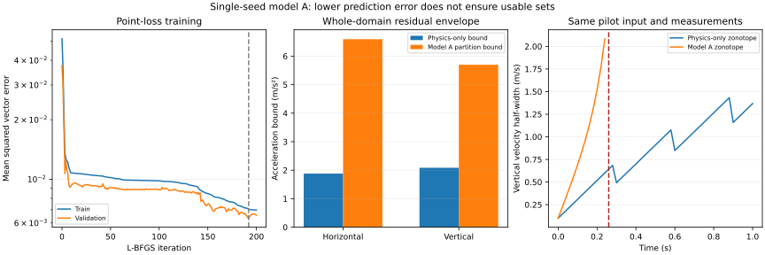

# 10 模型 A：训练、逐模型包络和滤波负结果

本轮完成点预测模型 A 的可运行 pilot，包括真实训练权重、独立验证、全域分区包络、学习模型 zonotope 传播和同源数据重放。**模型 A 尚未通过集合估计可用性门**：点预测误差下降，但当前包络/余项实现导致重放在 0.26–0.36 秒超域停止。不能把本轮描述为学习控制成功。

## 1. 已实现模块与运行命令

| 文件 | 内容 |
|---|---|
| `src/smf_mpc/neural_model.py` | 5→32→32→2 tanh/tanh/linear 网络；显式反向传播、输入 Jacobian、区间输出界和方向二阶导数界 |
| `src/smf_mpc/residual_envelope.py` | 真实解析加速度减网络输出的整域分区外包；模型与配置绑定 |
| `src/smf_mpc/learned_filter.py` | 学习名义动力学、包含神经网络余项的 zonotope 预测、原有测量更新和域检查 |
| `scripts/train_model_a.py` | 独立轨迹生成、训练与验证选择、模型/包络导出 |
| `scripts/evaluate_model_a.py` | 复用 G1 真值/输入/观测的九条配对重放，保留提前失败 |
| `verification/check_model_a_artifact.py` | 对实际训练权重核查导数、余项、分区重生成及全域抽样诊断 |

在仓库根目录：

```bash
python -m pip install -r verification/requirements.txt
python -m unittest discover -s tests -v
python scripts/train_model_a.py --output results/my_model_a
python verification/check_model_a_artifact.py results/my_model_a --output results/my_model_a/artifact_checks.json
python scripts/evaluate_model_a.py results/my_model_a --output results/my_model_a_replay
```

训练/重放目录须为空。可选 Matplotlib 3.10.8 画图：

```bash
python scripts/plot_model_a.py results/my_model_a results/my_model_a_replay
```

当前环境未安装 PyTorch，因此本轮采用 **NumPy float64 显式反向传播＋SciPy L-BFGS-B**。网络结构及点损失与方案一致，优化器不同于后续可微集合训练路线。这是单模型 A 的验证性实现，尚不能与未实现的 B/C/D 作优化预算公平性比较。模型以 JSON 导出，不依赖不透明序列化格式。

## 2. 数据合同与规模

本轮使用方案种子范围的子集：120 条训练轨迹（10000–10119）和 40 条验证轨迹（20000–20039）。每条 20 秒、1000 步，每五步记录一次标签，共 **24000 个训练样本和 8000 个验证样本**。本次均完成生成；代码保留越域轨迹的有效前缀及失败元数据，不静默删掉整条轨迹。

这不是 04 中全部 1200/200 条正式实验规模。没有使用 40000 段正式测试种子；全域抽样诊断使用 30000，滤波继续使用已有 70001–70003 pilot。

采集器使用真值反馈 PD 产生激励与受限推力/力矩，参考为平滑位置正弦，风在每条轨迹内固定并从声明域采样。真值只用于离线采集与解析加速度标签；在线学习滤波不访问真值模块。每条轨迹先分配 split，再采样；特征保持物理归一化，不用验证统计量缩放。

标签直接取解析气动加速度，未将含噪速度差分当成无误差标签。隐藏风不作为网络输入，因此拟合存在未观测参数引起的误差。数据生成器、种子和逐轨迹样本哈希在 [数据记录](../../results/model_a_20260909/data_manifest.json) 中；完整训练数组可由脚本再生。

## 3. 点损失、梯度与模型选择

网络记为：

```math
h_1=\tanh(W_1s+b_1),\quad
h_2=\tanh(W_2h_1+b_2),\quad
\widehat a=W_3h_2+b_3.
```

训练目标只包含点误差：

```math
L_A=\frac1B\sum_{b=1}^{B}\|\widehat a_b-a_b^*\|_2^2.
```

输出层误差梯度为 $`2(\widehat a_b-a_b^*)/B`$，逐层乘相应权重及 $`1-\tanh^2`$。已用随机参数方向中心差分核查全部参数向量的解析梯度；不是只检查某一个输出层。

单初始化 61001，L-BFGS-B 上限 200 次迭代，每次记录训练/验证损失，保存验证损失最小的 checkpoint。本次选中 **第 192 次迭代**。优化器在第 200 次因达到迭代上限停止，`optimizer_success=false` 已如实保存；不能声称已证明收敛或得到全局最优解。

| 验证集加速度 RMSE | 水平方向 | 竖直方向 |
|---|---:|---:|
| 零残差物理预测器 | 0.18576 m/s² | 0.05875 m/s² |
| 模型 A | 0.07046 m/s² | 0.03716 m/s² |

[训练记录](../../results/model_a_20260909/training_summary.json)、[迭代历史](../../results/model_a_20260909/history.json)、[实际权重](../../results/model_a_20260909/model.json)。这些结果是单初始化 pilot，不是论文最终效应量。

## 4. 每个网络重新计算误差包络

认证对象是整个真实模型差函数，变量为五个归一化输入及两个隐藏风分量。采用固定七维域循环二分，深度 14，得到 **16384 个覆盖整域的叶单元**；不丢弃困难区域。

对每个叶单元 Q 分别求解析真值加速度区间和网络 IBP 区间：

```math
[a_*](Q)=[\ell_*,u_*],\quad
[a_\theta](Q)=[\ell_\theta,u_\theta],
\qquad
\bar r(Q)=\max\{|\ell_*-u_\theta|,|u_*-\ell_\theta|\}.
```

最大值和绝对值均按分量计算。全域加速度误差半径是各叶单元分量最大值；乘 h 注入速度状态，并另加外部过程误差。两个区间独立相减损失了同一输入的依赖，故该界可能很松。

| 全域加速度包络半径 | 水平方向 | 竖直方向 |
|---|---:|---:|
| 原物理预测器的解析界 | 1.87990 m/s² | 2.08550 m/s² |
| 模型 A 的分区区间界 | 6.59394 m/s² | 5.69755 m/s² |
| 5000 个全域诊断点上的模型 A 最大误差 | 1.27767 m/s² | 1.68197 m/s² |

第三行只是样本最大值，不能替代第二行，也不能证明真实最坏误差等于该值。它提示当前计算包络有明显松弛，同时训练数据未穷尽整个工作域；两种因素还需分别诊断。

[包络描述](../../results/model_a_20260909/envelope.json) 绑定权重和完整配置哈希；[全部分区及叶界](../../results/model_a_20260909/envelope_leaves.npz) 可重生成核验。当前采用 float64 和工程膨胀，**未完成严格舍入认证**，状态为 `CONDITIONAL_ANALYTIC_PARTITION_FLOAT64_NOT_CERTIFIED`。其数学外包前提依赖声明的解析真值模型，不能转用于未知真实无人机。

## 5. 神经网络的非线性余项没有省略

对于 $`s(t)=s_c+t\delta s`$，假设 $`|\delta s|\le r_s`$。用向量 p/q 逐层外包一阶/二阶方向导数的绝对值，初始化 $`p=r_s,q=0`$。经过仿射层：

```math
\widetilde p=|W|p,\qquad \widetilde q=|W|q.
```

若经过 tanh，在该层整个预激活区间上取 $`d_1\ge|\tanh'|`$ 和 $`d_2\ge|\tanh''|`$：

```math
p^+=d_1\odot\widetilde p,\qquad
q^+=d_2\odot\widetilde p^{\odot2}+d_1\odot\widetilde q.
```

代码检查二阶导数内部极值 $`\tanh(z)=\pm1/\sqrt3`$；其全局幅值上界为 $`4/(3\sqrt3)`$。最终线性输出层后二阶方向界的一半给出 Taylor 余项半径。当前实际输入固定，因此 $`r_s=[r_{v_x}/3,r_{v_z}/3,r_\phi/0.45,0,0]^T`$。

预测 Jacobian 正确加入网络状态导数：

```math
A_\theta=A_0+hE_cJ_\theta(s_c)D_s,
\qquad D_s=\partial s/\partial x.
```

实际控制输入的 Jacobian 在后续 MPC 实现时仍须补齐；本轮只实现固定输入状态集合预测，不声称已完成控制模型导数接口。

该正绝对值链式界可能放大网络层间的相消误差。在本次有效重放前缀，水平神经离散余项界最大约 0.4353 m/s，竖直约 0.2464 m/s，足以明显扩大集合。它们是不同时间的最大值，不是同一时刻实际发生的误差。

## 6. 配对滤波结果：可用性门未通过

使用预算 60，与 09 的相同源轨迹、实际输入及潜在测量噪声逐条比对哈希。没有使用未来测量；失败时未将集合裁剪回域内。

| 工况 | 模型 A 的 3 条轨迹 | 物理 zonotope 对照 | 模型 A 有效前缀成员漏出 |
|---|---|---|---:|
| S0 正常测量 | 均在 0.36 s 超域停止 | 均完成 20 s | 0 |
| S1 连丢一包 | 均在 0.30 s 超域停止 | 均完成 20 s | 0 |
| S2 连丢两包 | 均在 0.26 s 超域停止 | 均完成 20 s | 0 |

这是集合超域，不是推断真值坠毁。提前停止后的滤波行为未计算，不可因有效前缀没有漏出就称整个轨迹通过。

[重放汇总](../../results/model_a_replay_20260909/summary.json)、[完整压缩日志](../../results/model_a_replay_20260909/steps.csv.gz)。模型 A 的耗时统计只覆盖很短失败前缀，不能与物理基线完整 20 秒直接比较 p99 或声称实时性改善；此前实时门仍未通过。



## 7. 实际核查与下一步研究决策

本轮 **32 项单元/性质测试通过**。另对实际训练权重执行独立工件检查：全部分区及界重生成一致；5000 个全域诊断点无样本包络违反；100 个点的 Jacobian 中心差分最大误差约 $`4.29\times10^{-10}`$；1000 次余项样本核查未发现违反。[工件检查记录](../../results/model_a_20260909/artifact_checks.json)、[测试日志](../../results/model_a_20260909/tests.txt)。这些有限检查不能替代严格证明。

已经可以确定的是：当前点模型训练管线和学习模型滤波接口可运行，但**“预测更准”没有转化为“集合更可用”**。尚不能确定根因有多少来自真实外推误差、残差分区松弛和网络余项松弛；也不能由 A 失败推断 D 必然成功。

下一步优先级：

1. 分离残差包络与神经余项两种松弛，分别比较更紧的同变量差函数界、局部合法分区界、整体均值形式/仿射传播。不要直接把抽样最大值乘经验系数当成新保证。
2. 在验证/pilot 上尝试更紧包络算法，保存认证耗时与域覆盖；若改变模型正则或结构，将其明确标为 B/新基线，不能继续称同一 A。
3. 只有学习模型达到有限时集合可用性门，才冻结 B/C/D 的同构集合传播和训练预算，开展候选创新机制消融。
4. 保留目前的物理 zonotope 作为可重复的数值对照，同时继续解决尾延迟。MPC 和理论证明不能跳过模型误差与观测器一致性前提。

没有修改原误差合同来掩盖失败，也没有将本轮单模型 pilot 写成正式实验或控制成果。
