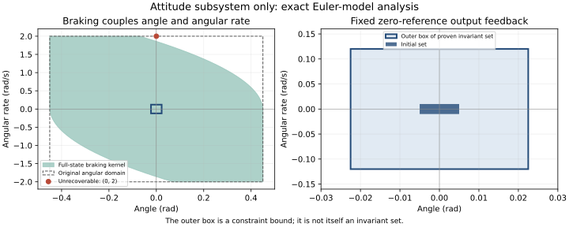

# 当前参数下的控制不变性：必要边界与姿态子系统证书

日期：2026-09-10。承接 [理论设计](01_proof_first_design.md) 和 [实施准入](02_review_and_gates.md)。

**本轮结论：** 已证明原任务域不能整体作为控制不变域，并构造出包含当前姿态初始集合的非空输出反馈鲁棒不变集。六维平移—姿态系统的不变信息状态族仍未构造；不能将姿态子系统结果作为全系统通过，更不能作为深度学习优势。

本轮进行数学推导与精确有理数核对，没有部署控制器、训练新网络或执行新的闭环轨迹仿真。证书中的反馈律是存在性证明的见证，不是已接入仓库 MPC 的算法。

## 1 固定坐标直积盒的结构性障碍

### 命题 A：位置—速度厚盒不可能控制不变

考虑本仓库的定义离散模型 $`p^+=p+hv`$。设一个固定非空候选状态集包含独立坐标因子：

```math
[p_-,p_+]\times[v_-,v_+],\qquad -\infty<p_-\leq p_+<\infty.
```

在 $`p=p_+`$ 的上边界，需要所有允许速度满足 $`v\leq0`$，故 $`v_+\leq0`$。在 $`p=p_-`$ 的下边界，需要 $`v\geq0`$，故 $`v_-\geq0`$。结合非空性，只可能有 $`v_-=v_+=0`$。

**因此，含非零速度厚度的固定位置—速度直积盒，不可能是一步控制不变集。** 证明与增益、网络、分区精度无关，因为当前控制当步不改变位置更新。姿态—角速度因子也有同样障碍。

这不排除使用盒作估计外包，也不排除移动中心的盒族。它要求允许中心与速度之间保留相位关系，或使用带倾斜面的多面体、相关生成元集合、信息状态不变族。不能把任意位置中心和任意速度中心独立组合后，仍声称整个族不变。

## 2 离散制动边界及任务域内的不可恢复状态

对离散双积分通道，外向速度 $`s>0`$，每步最多产生制动加速度 $`b>0`$。定义：

```math
n(s)=\left\lceil\frac{s}{hb}\right\rceil,\qquad
S_h(s;b)=hn(s)s-\frac{h^2b}{2}n(s)(n(s)-1),\qquad S_h(0;b)=0.
```

**推导。** 最快制动时前 n 个位置增量至少为 $`h(s-jhb)`$，$`j=0,\ldots,n-1`$。最后一步可用小于最大值的制动恰好到达零速，因此上式既是必要的最小外向位移，也是无其他耦合限制时可达到的位移。不能用连续时间 $`s^2/(2b)`$ 直接替换。

### 2.1 当前姿态通道的精确全状态制动核

当前 $`h=1/50`$、$`J=1/50`$、$`|\tau|\leq2/25`$，故最大角减速度 $`b_\omega=4`$。在假设姿态状态完全已知的独立角通道上，存活核为：

```math
\mathcal K_{\rm brake}=
\left\{(\phi,\omega):|\omega|\leq2,\quad
\phi+S_h((\omega)_+;4)\leq0.45,\quad
-\phi+S_h((-\omega)_+;4)\leq0.45\right\}.
```

必要性来自最快制动也需要该位移；充分性可用向零角速度最大制动、最后一步恰好停止、之后零力矩证明。姿态在制动过程中单调，不会触碰反向边界，角速度绝对值不增加。

在 $`|\omega|\leq2`$ 上，制动距离还是有限个仿射函数的最大值，因此核可精确写为多面体：

```math
\phi+hn\omega\leq0.45+\frac{h^2b_\omega}{2}n(n-1),\qquad n=0,\ldots,25,
```

```math
-\phi-hn\omega\leq0.45+\frac{h^2b_\omega}{2}n(n-1),\qquad n=0,\ldots,25,
\qquad |\omega|\leq2.
```

这是全状态独立角通道的结论；测量不确定时，不同可能状态必须共用同一控制，不能直接把每个点各自的制动控制拼接为输出反馈策略。

### 2.2 一个无须仿真的反例

取原域内的状态 $`\phi_0=0,\omega_0=2`$。最快刹停需要 25 步，最小位移为：

```math
S_h(2;4)=\frac{13}{25}=0.52>0.45.
```

更具体地，任意允许控制下，第 17 步角度至少是：

```math
\phi_{17}\geq h\,17\cdot2-\frac{h^2\cdot4}{2}\,17\cdot16
=\frac{289}{625}=0.4624>0.45.
```

第 16 步最快制动角度为 0.448，第一步也在域内。这证明“当前域内 + 一步可行”不意味着能够无限期留域。该反例不在给定的小初始姿态集合内，因此不否定从当前初始集出发存在安全策略。

## 3 正向结果：含测量误差的姿态输出反馈不变集

### 3.1 固定模型和反馈见证

只使用每个 tick 已到达的角度、角速度测量：

```math
y_k^\phi=\phi_k+\nu_k^\phi,\quad |\nu_k^\phi|\leq0.005,\qquad
y_k^\omega=\omega_k+\nu_k^\omega,\quad |\nu_k^\omega|\leq0.01.
```

定义固定零姿态调节律：

```math
\tau_k=-\frac8{25}y_k^\phi-\frac4{25}y_k^\omega.
```

令 $`z=(\phi,\omega)^\top`$，则真实闭环是：

```math
z_{k+1}=Mz_k+b\eta_k,\qquad
M=\begin{bmatrix}1&1/50\\-8/25&21/25\end{bmatrix},\quad
b=\begin{bmatrix}0\\1\end{bmatrix},
```

```math
\eta_k=-\frac8{25}\nu_k^\phi-\frac4{25}\nu_k^\omega,
\qquad |\eta_k|\leq\frac2{625}=0.0032.
```

无需测量噪声独立、零均值或高斯假设。实际控制只使用测量，证明中的真实状态用于分析。

### 3.2 解析构造及无穷级数收敛

令 $`r=23/25`$、$`N=M-rI`$，直接计算得：

```math
N=\begin{bmatrix}2/25&1/50\\-8/25&-2/25\end{bmatrix},\qquad
N^2=0,\qquad M^j=r^jI+jr^{j-1}N\quad(j\geq1).
```

因为 $`0<r<1`$，$`M^j\to0`$，并且以下绝对收敛级数成立：

```math
\sum_{j=0}^{\infty}r^j=\frac1{1-r},\qquad
\sum_{j=1}^{\infty}jr^{j-1}=\frac1{(1-r)^2}.
```

当前初始角状态集为 $`\mathcal Z_0=[-0.005,0.005]\times[-0.01,0.01]`$。定义：

```math
\mathcal H=\overline{\operatorname{conv}}
\left(\bigcup_{j\geq0}M^j\mathcal Z_0\right),\qquad
\mathcal S=\bigoplus_{j=0}^{\infty}M^j b[-2/625,2/625],
\qquad \mathcal K_\angle=\mathcal H\oplus\mathcal S.
```

这里无穷和表示所有满足 $`|\eta_j|\leq2/625`$ 的收敛级数 $`\sum_{j=0}^{\infty}M^jb\eta_j`$ 构成的集合。由一致绝对收敛可知该集合紧。$`\mathcal H`$ 同样为紧集。$`\mathcal H`$ 包含初始集，且 $`0\in\mathcal S`$，所以 $`\mathcal Z_0\subseteq\mathcal K_\angle`$。

### 定理 B：姿态子系统的鲁棒正不变性

对所有允许的角观测误差序列：

```math
M\mathcal H\subseteq\mathcal H,\qquad
M\mathcal S\oplus b[-2/625,2/625]=\mathcal S,
```

因此：

```math
M\mathcal K_\angle\oplus b[-2/625,2/625]\subseteq\mathcal K_\angle.
```

**证明。** 第一式由将轨道并集的指标前移一位并保持线性映射下凸包/闭包关系得到；第二式由绝对收敛级数移项得到；二者作 Minkowski 和即得。证毕。

该构造保留姿态与角速度的相关性。它的下述矩形外包只用来验证坐标和输入约束，不能替代 $`\mathcal K_\angle`$ 声称矩形本身不变。

### 3.3 完整的域和扭矩核对

令 $`r_0=(1/200,1/100)^\top`$。利用 $`r^j\leq1`$ 和 $`jr^{j-1}\leq1/(1-r)`$，可取：

```math
\operatorname{rad}(\operatorname{box}\mathcal H)
\leq r_0+\frac{|N|r_0}{1-r}
=\begin{bmatrix}1/80\\1/25\end{bmatrix}.
```

后一标量不等式可由 $`jr^{j-1}\leq\sum_{i=0}^{j-1}r^i\leq1/(1-r)`$ 证明。无穷扰动和的外包半宽满足：

```math
\operatorname{rad}(\operatorname{box}\mathcal S)
\leq\frac2{625}\left(\frac{|b|}{1-r}+\frac{|Nb|}{(1-r)^2}\right)
=\begin{bmatrix}1/100\\2/25\end{bmatrix}.
```

故真实不变集满足：

```math
\mathcal K_\angle\subseteq[-9/400,9/400]\times[-3/25,3/25]
=[-0.0225,0.0225]\times[-0.12,0.12].
```

对所有允许测量误差，实际输出反馈指令满足：

```math
|\tau_k|\leq\frac8{25}\frac9{400}+\frac4{25}\frac3{25}+\frac2{625}
=\frac{37}{1250}=0.0296<0.08.
```

| 已证明上界 | 数值 | 当前允许值 | 余量 |
|---|---:|---:|---:|
| 角度绝对值 | 0.0225 rad | 0.45 rad | 0.4275 rad |
| 角速度绝对值 | 0.12 rad/s | 2 rad/s | 1.88 rad/s |
| 扭矩绝对值 | 0.0296 N·m | 0.08 N·m | 0.0504 N·m |

先对未饱和表达式证明上述不变性，再验证它在该集合内永远不会触发饱和，从而闭合实际输入约束。初始集属于该集合，故是无穷时域结论；不是特征值小于 1 后直接宣称带约束系统稳定，也不是有限时间数值结果。

### 3.4 证书适用边界

本证书依赖当前精确角动力学、固定惯量、零外部角过程增量、20 ms 无延迟角测量，以及固定零姿态反馈律。允许任意位置丢包，因为该子律不读取位置；但不允许角测量丢包而仍引用本证书。

本小节的零参考证书不允许任意 MPC 力矩替换上述律；非零或时变倾角必须使用下一小节明确推导的参考生成规则。原模型将 T 和 τ 视为独立有界输入；实机电机分配若使二者耦合，需重新验证执行可行性。

可以将已知真值位于 $`\mathcal K_\angle`$ 的角信息状态、与当前观测相容的子集组成角信息状态族：同一测量得到同一个 τ，而每个相容真值都满足上述扰动关系，因此后继仍留在该角不变集。这仍不是平移—姿态的联合信息状态族。



图左是准确状态下的制动核；图右是含测量误差、固定零参考反馈证书的外包界。图形由解析公式绘制，仅作说明，不作为数值证书。

### 3.5 时变倾角跟踪：可用于平移耦合的已证接口

为避免将零参考结论直接套到倾角指令上，引入控制器内部已知参考 $`c_k=(\psi_k,\rho_k)^\top`$，采用与角动力学一致的生成器：

```math
c_{k+1}=Ac_k+b\mu_k,\qquad
A=\begin{bmatrix}1&h\\0&1\end{bmatrix},\qquad
b=\begin{bmatrix}0\\h/J\end{bmatrix}=\begin{bmatrix}0\\1\end{bmatrix}.
```

$`\mu_k`$ 是前馈扭矩，不能与倾角增量或角加速度混为一谈。令 $`K=[8/25,4/25]`$，使用：

```math
\tau_k=\mu_k-K(y_k-c_k),\qquad e_k=z_k-c_k.
```

直接相减，而不是忽略参考变化，得到：

```math
e_{k+1}=(A-bK)e_k-bK\nu_k=Me_k+b\eta_k.
```

所以只要 $`e_0\in\mathcal K_\angle`$，同一个误差不变集对所有满足生成器等式的参考序列有效。参考可以依赖当前已到达测量与过去信息；相减等式逐路径成立，不需要参考与噪声独立。时序必须为先读取当前 $`y_k`$、选取 $`\mu_k`$、计算并执行 $`\tau_k`$，再将内部参考更新为 $`c_{k+1}`$；不能读取未来测量。

同一个 μ 必须同时用于实际力矩与参考递推。每次 MPC 重求解后不能任意重置内部参考或直接替换为外部采样指令；否则会出现额外参考跳变项，原误差证书不再直接适用。

由三角不等式，以下收紧参考约束足以同时保证原角度、角速率和扭矩约束：

```math
|\psi_k|\leq\frac{171}{400}=0.4275,\qquad
|\rho_k|\leq\frac{47}{25}=1.88,\qquad
|\mu_k|\leq\frac{63}{1250}=0.0504.
```

参考本身仍不能使用整个坐标盒作为不变集。利用第 2 节的精确制动公式，可构造：

```math
\mathcal C=\left\{(\psi,\rho):|\rho|\leq1.88,\quad
\psi+S_h((\rho)_+;2.52)\leq0.4275,\quad
-\psi+S_h((-\rho)_+;2.52)\leq0.4275\right\},
```

其中 $`2.52=0.0504/J`$。它非空、包含原点，对已知内部参考的受限双积分动力学控制不变。其精确多面体表示与第 2 节相同，改用半宽 0.4275、减速度 2.52、$`n=0,\ldots,38`$。

定义参考允许动作：

```math
\mathcal U_c(c)=\left\{\mu:|\mu|\leq0.0504,\quad Ac+b\mu\in\mathcal C\right\}.
```

每个 $`c\in\mathcal C`$ 都有非空 $`\mathcal U_c(c)`$，因为最大制动并在末步恰好停止给出一个共同可执行的见证。选用任意因果 $`\mu_k\in\mathcal U_c(c_k)`$，即可保持扩展状态族 $`\mathcal C\times\mathcal K_\angle`$ 中的 $`(c_k,e_k)`$，从而对所有相容真实角状态和所有角测量误差保证约束。给定初始 $`c_0=0`$，当前真实角初始集满足 $`e_0\in\mathcal K_\angle`$。

明确的制动见证为 $`\mu=-(J/h)\operatorname{sgn}(\rho)\min\{(h/J)0.0504,|\rho|\}`$。量词次序为：

```math
\forall c\in\mathcal C,\quad \exists\mu\in\mathcal U_c(c),\quad
\forall e\in\mathcal K_\angle,\quad\forall\nu\in\mathcal V:\qquad
(c^+,e^+)\in\mathcal C\times\mathcal K_\angle.
```

该存在性见证只需已知内部参考 c，不要求读取真实误差 e。误差初始条件必须是属于相关不变集本身，不能仅检查其矩形外包。

**非零参考的具体可行见证。** 从 $`c_0=0`$ 开始，连续 20 步使用 $`\mu=1/40=0.025`$，随后 20 步用 $`\mu=-1/40`$，再保持零。对该双积分递推求和得：

```math
\rho_{\max}=20\cdot0.025=0.5,\qquad
\psi_{40}=h\cdot0.025\cdot20^2=0.2,\qquad \rho_{40}=0.
```

参考角度全程单调位于 $`[0,0.2]`$，角速度位于 $`[0,0.5]`$，40 步即 0.8 s 后到达非零倾角。每个中途参考都有后续可行停止序列，因而属于精确制动核 $`\mathcal C`$。带任意允许角测量误差的真实角度绝对值不超过 0.2225，角速率不超过 0.62，扭矩不超过 0.0546，均在原约束内。这是解析见证，没有运行一条轨迹后将结果外推为证明。

该接口只证明倾角参考可跟踪且约束可保持。它没有保证给定平移状态总能找到同时合格的 T 和参考动作 μ；这正是下一节的剩余耦合问题。

## 4 平移通道为何仍未闭合

固定零倾角调节无法主动抵消横向风引起的平移。上一节已提供时变倾角的可跟踪动作集合，但六维证书还需要证明横向制动所要求的参考动作属于该集合，并与垂直推力限制、位置缺测相容。不能仅凭角跟踪证书直接拼成完整四旋翼控制器。

### 4.1 共享推力的一步鲁棒条件

对独立坐标信息盒 X，首先必须满足不受当步输入影响的条件：

```math
p_r^-+hv_r^-\geq p_{r,\min},\qquad p_r^++hv_r^+\leq p_{r,\max},
```

```math
\phi^-+h\omega^-\geq-0.45,\qquad \phi^++h\omega^+\leq0.45.
```

针对独立加速度误差盒 $`d_r\in[-\bar d_r,\bar d_r]`$，令 $`c_{\min},c_{\max}`$ 为当前角区间上 cos 的最小/最大值，则单个共享推力必须同时满足：

```math
v_x^- -h(T/m)\sin\phi^+ -h\bar d_x\geq-3,\qquad
v_x^+ -h(T/m)\sin\phi^- +h\bar d_x\leq3,
```

```math
v_z^- +h((T/m)c_{\min}-g)-h\bar d_z\geq-3,\qquad
v_z^+ +h((T/m)c_{\max}-g)+h\bar d_z\leq3,
```

并与 $`T\in[4.905,14.715]`$ 取交。扭矩还必须位于：

```math
[-0.08,0.08]\cap
\left[\frac Jh(-2-\omega^-),\frac Jh(2-\omega^+)\right].
```

这些条件对该独立盒抽象的一步域内包含是精确的；如果先将相关集合外包为盒，检查失败不能证明原相关集合没有可行输入。

### 4.2 独立气动盒下的推力冲突反例

取 $`\phi=0.2,v_x=v_z=3`$，其余坐标在内域，$`\bar d_x=1.880,\bar d_z=2.086`$。保持两个速度上边界分别要求：

```math
T\sin(0.2)\geq1.880,\qquad T\cos(0.2)\leq9.81-2.086=7.724.
```

由 $`\sin(0.2)\leq0.2`$、$`\cos(0.2)\geq0.98`$，即使采用乐观必要界也得到：

```math
T\geq9.4>\frac{7.724}{0.98}=\frac{1931}{245}\approx7.881633\geq T.
```

所以不存在共享推力。分别给水平和垂直轴找一个 T 是错误的量词交换。这个反例针对独立气动误差盒，**不能据此声称具有状态/风相关结构的解析气动真模型在该状态也无解**。

## 5 完整系统证书剩余的具体数学任务

当前已得到角子系统的非空证书，但完整 P2 门尚未通过。后续只推进下列证明任务，不恢复网络训练或控制性能试验：

1. **平移需求与参考动作的相容性。** 以 3.5 的已证跟踪族和非空参考动作集为起点，证明横向制动需求确实可由允许参考实现；不能假定实际倾角可在当步自由指定。
2. **平移—姿态耦合前驱。** 使用同一个 T 和由 μ 诱导的 τ，对位置—速度制动边界、参考制动核以及所有相容状态同时构造前驱；保留气动力与速度/风的依赖，区分物理极限与独立盒抽象的保守性。
3. **缺测模式与初始集。** 合并已有窗口界，证明所有允许观测后继进入同一模式族，包含尚未得到两次位置测量的启动阶段；检查测量到达前的先验时刻。
4. **无穷时域闭合。** 给出非空集合族、初始信息状态包含关系，以及每个允许后继的统一控制证据；有限步可行和必要制动条件都不能替代它。

若对某个指定候选族找不到证书，只能否定该候选或记录充分条件尚未满足，不能宣布所有控制器都不可能。相反，只验证当前任务域内几个点可制动，也不能宣布整体可行。

## 6 可复核产物与文献边界

[check_invariance_theory.py](../../verification/check_invariance_theory.py) 用 Python 标准库 Fraction 核对全部有限有理数恒等式、N²=0、级数外包计算、输入余量、不可恢复状态和推力矛盾。它读取并核对关键配置，使用精确算术，不运行轨迹。

```bash
python verification/check_invariance_theory.py --output /tmp/invariance_exact_checks.json
```

输出文件须不存在。归档 [精确核对结果](../../results/theory_invariance_20260910/exact_checks.json) 同时记录配置和脚本 SHA-256，并明确 full_six_state_invariance_proved=false。无穷级数与归纳论证由本文给出，脚本不是自动定理证明器；39 项旧代码测试不作为本轮证明依据。

不变集用于输出反馈约束控制已有成熟文献：[Lorenzetti 与 Pavone 的线性鲁棒输出反馈 MPC](https://arxiv.org/abs/1911.07360) 讨论 RPI 计算；[Didier 等的四旋翼鲁棒自适应 MPC](https://arxiv.org/abs/2102.13544) 讨论不变多面体及测量误差的实践问题。本轮只核查其原始论文页面，不将本文的具体矩阵、数值或角通道命题归为这些来源中的原定理。本文的解析构造是当前模型的基础证书，不宣称是新颖性成果。

本轮按用户指定 ARS 的反方审查方式核对关键推导，独立审查确认了角不变集、扭矩界及离散制动反例；追加审查确认时变参考的误差抵消、参考动作非空性和非零指令见证，并要求明确禁止任意参考重置及子系统边界。数学材料由 AI 辅助编写，仍需作者复核。
