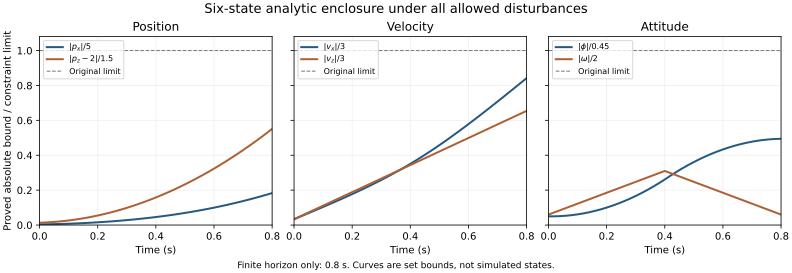

# 共同控制前驱与六维有限时域证书

推导日期：2026-09-10；最终审查修订：2026-09-11。承接 [03 姿态不变集与参考跟踪](03_invariant_domain_analysis.md)。本轮研究问题是：在原参数、原初始集合和原测量合同下，如何把角跟踪证书接入平移约束，哪些可行性结论能够先于控制实现成立？

**本轮已证明：固定信息与目标多面体时，一步鲁棒可行动作集对共同推力/参考扭矩是凸集；从给定初始集合出发，存在覆盖所有允许扰动和角测量误差的 40 步六维域内先验管。** 另给出一个抽象保守性的严格见证，并证明固定倾角延续不能作为终端策略。完整无限时域信息状态不变族、MPC 递归可行性和神经网络独立优势仍未证明。

本轮只写数学材料和辅助精确算术检查，没有训练网络、运行新的真实状态轨迹仿真或接入控制器。本文的存在性反馈及参考指令用于证明，不能当作已实现 MPC。

## 1 沿用的信息合同与实际输入

当前信息状态 I 在接收当步测量之后固定，包含可靠状态集合 X、实际输入/测量历史、已知内部参考 $`c=(\psi,\rho)`$、当前角测量 $`y^\angle`$ 和传感器模式。所有相容角状态满足：

```math
z-c\in\mathcal K_\angle,\qquad
y^\angle-z\in\mathcal V_\angle,\qquad z=(\phi,\omega).
```

$`\mathcal K_\angle`$ 是 03 中保留相关性的误差不变集。它的矩形外包不能替代上述成员条件。

当步共同决策是 $`a=(T,\mu)`$，实际输入必须是：

```math
u(I,a)=
\begin{bmatrix}
T\\ \mu-K(y^\angle-c)
\end{bmatrix},\qquad K=[8/25,\ 4/25].
```

内部参考依照 $`c^+=Ac+b_c\mu`$ 更新，$`b_c=(0,h/J)^\top`$，$`\mu\in\mathcal U_c(c)`$，其中 $`\mathcal U_c`$ 与参考制动核 $`\mathcal C`$ 均见 03 的 3.5。参考状态不能每步重置。

不能先为两个平移轴各选一个推力，再假定能够合成共同 T；也不能把下一步实际倾角作为可立即任意指定的决策。在当前 Euler 模型中：

```math
\phi^+=\phi+h\omega,\qquad
\omega^+=\omega+(h/J)\tau.
```

当步 μ 不影响 $`\phi^+`$，也不影响当步平移速度更新。若固定后续推力序列，仅考察 μ 经姿态的直接动力学通路，其影响最早进入第三步平移速度、第四步位置。若后续推力策略读取角速率并改变 T，则存在额外控制通路，不能不加限定地使用这一延迟计数。

本轮正向 40 步证书只使用已有的对称气动加速度合同：

```math
d_x\in[-1.880,1.880],\qquad d_z\in[-2.086,2.086].
```

它允许每步任意取值，不要求概率独立性、零均值、风可预测或网络精度。第 5 节另用解析基准真值作离线结构比较；其额外信息边界单独说明。

## 2 定理 C：固定信息下的一步鲁棒可行动作集是凸集

### 2.1 对输入仿射的真实更新

对原对称气动盒模型，可以写成：

```math
v_r^+=v_r+h\{q_r(\zeta)T+b_r(\zeta)\},\qquad
q_x=-\sin\phi/m,\quad q_z=\cos\phi/m,\quad
b_x=d_x,\quad b_z=-g+d_z.
```

这里 $`\zeta=(x,d)`$ 的允许集合在当前信息 I 固定后不依赖待选的 T、μ。状态上的非线性并不改变“对输入仿射”的事实。

若具有共同可用的解析气动结构合同，则取 $`\zeta=(x,\beta)`$，$`r_x=v_x-\beta_x,r_z=v_z-\beta_z`$，同样得到：

```math
q_x=-\frac{\sin\phi}{m}+\frac{0.08}{mg}\sin(2\phi),\qquad
b_x=-0.12r_x\sqrt{r_x^2+0.04}-0.03r_xr_z-0.08\sin(2\phi),
```

```math
q_z=\frac{\cos\phi}{m},\qquad
b_z=-g-0.15r_z\sqrt{r_z^2+0.04}+0.02r_x^2\cos\phi.
```

后者不是允许在线调用隐藏真值模块的授权；必须先确定哪些结构不等式属于公共知识。

### 2.2 将耦合目标约束写为半空间交

固定目标多面体 $`P=\{x:H_i x\leq\ell_i,\ i=1,\ldots,s\}`$。记 $`q=(q_x,q_z)^\top,b_v=(b_x,b_z)^\top`$；将第 i 行拆成位置、速度、角度、角速率系数 $`H_i=(a_p^\top,a_v^\top,a_\phi,a_\omega)`$，则：

```math
H_i x^+=A_i(\zeta)+B_i(\zeta)T+C_i\mu,
```

```math
\begin{aligned}
A_i={}&a_p^\top(p+hv)+a_v^\top v+h a_v^\top b_v
+a_\phi(\phi+h\omega)\\
&+a_\omega\{\omega-(h/J)K(y^\angle-c)\},\\
B_i={}&h a_v^\top q,\qquad C_i=(h/J)a_\omega.
\end{aligned}
```

因此一步鲁棒目标包含条件为：

```math
\sup_{\zeta\in\mathcal Z(I)}
\{A_i(\zeta)+B_i(\zeta)T\}+C_i\mu\leq\ell_i,\qquad i=1,\ldots,s.
```

这里使用同一个 T、μ 检查全部面、全部相容状态和全部允许扰动。目标可以有位置—速度倾斜面，不限于坐标盒。

**定理 C。** 当 I、$`\mathcal Z(I)`$ 和 P 均对候选动作固定时，所有满足上述条件、$`\mu\in\mathcal U_c(c)`$、推力约束及实际扭矩约束的 $`(T,\mu)`$ 构成凸集；该集合可能为空。

**证明。** 对每个固定的 $`\zeta`$、i，约束对 $`(T,\mu)`$ 是一个半空间。任意多个半空间的交仍凸，不要求 $`\mathcal Z(I)`$ 或 X 本身凸。推力区间、$`|\mu-K(y^\angle-c)|\leq0.08`$ 都是凸约束。参考制动核 $`\mathcal C`$ 是有限仿射不等式定义的多面体，所以其仿射前像 $`\mathcal U_c(c)`$ 也是凸截面。取交即得。证毕。

等价地，上确界是仿射函数族的逐点上确界，因此对 T 凸。**凸性不保证可行集非空、全局上确界易算、实时可求或最优解唯一。** 多步动力学中未来姿态与 T 耦合，未来观测还依赖策略；不能据此声称整个输出反馈 MPC、所有目标族或整个状态前驱集合均凸。

## 3 由凸性得到的可复核求解方案

本节给出后续证书求解算法设计，本轮未运行这些新优化器。

对于固定 I、P，保留整个相关集合 $`\mathcal Z(I)`$，不先把气动力、角度与速度独立拆盒。可采用以下交换步骤：

1. 用已验证属于 $`\mathcal Z(I)`$ 的有限世界建立线性约束，再加入输入及参考动作约束，求一个候选 $`(T,\mu)`$。这些世界形成原半无限问题的松弛，候选本身尚无安全保证。
2. 对每个目标面，以区间分支定界、经验证凸松弛或适用的精确代数方法，计算完整面表达式的可靠上界 $`U_i\geq\sup_{\zeta\in\mathcal Z(I)}\{A_i(\zeta)+B_i(\zeta)T\}+C_i\mu`$。不能遗漏已知的参考扭矩项。
3. 若所有 $`U_i\leq\ell_i`$，记录候选输入、集合描述、各面证书、模型/配置哈希，并接受为一步动作证书。
4. 若发现一个经过成员核对、确实违反目标面的世界，加入其仿射约束后重新求解。局部最大化所得值只可提供反例下界，不能冒充步骤 2 的安全上界。
5. 若有限约束已经被可靠地证明不可行，例如有精确核对的 Farkas 对偶证书，则原半无限问题不可行。若只是上界太松、预算耗尽或求解器失败，返回“未得到证书”，不能返回“所有动作均不可能”。

最坏情况下交换过程不一定有限终止。分支预算、近边界容差和浮点实现都不能靠凸性自动解决。若 X 只是精确一致性集合的外包，证实“对 X 不存在共同输入”也不等于证实真实信息论问题无解。

对于多步信息状态前驱，还必须对全部未来观测分支重复检查。当前一步证书仅构成其一个构件。

## 4 定理 D：原初始集合的 40 步六维鲁棒域内先验管

### 4.1 固定的解析见证及域内气动界

沿用 03 的非零参考见证，$`c_0=0`$：

```math
T_k=mg=9.81,\qquad
\mu_k=
\begin{cases}
1/40,&0\leq k<20,\\
-1/40,&20\leq k<40,
\end{cases}
\qquad \tau_k=\mu_k-K(y_k^\angle-c_k).
```

原初始集合中心是 $`(0,2,0,0,0,0)`$，半宽为 $`(0.02,0.02,0.1,0.1,0.005,0.01)`$，没有放宽任何参数。

先独立核对气动合同在整个 D 内有效。由 $`|r_x|,|r_z|\leq3.5`$，可用严格有理数上界：

```math
3.5058^2=12.29063364>3.5^2+0.04.
```

结合 $`|\sin|\leq1,|\cos|\leq1,|T/(mg)-1|\leq0.5`$：

```math
|a_{*,x}|\leq0.12(3.5)(3.5058)+0.03(3.5)^2+0.04
=1.879936<1.880,
```

```math
|a_{*,z}|\leq0.15(3.5)(3.5058)+0.02(3.5)^2
=2.085545<2.086.
```

这些是解析基准的离线界来源。正向证明随后只用更大的原合同盒，不读取在线真值、速度真值或风。

### 4.2 参考多项式与两项求和

记 $`n=20,a=1/40`$。对 $`0\leq j\leq n`$：

```math
\psi_j=ha\,\frac{j(j-1)}2,\qquad \rho_j=aj.
```

对 $`j=n+s,\ 0\leq s\leq n`$：

```math
\psi_{n+s}=ha\left\{\frac{n(n-1)}2+ns-\frac{s(s-1)}2\right\},
\qquad \rho_{n+s}=a(n-s).
```

所以 $`0\leq\psi_j\leq0.2`$、$`0\leq\rho_j\leq0.5`$，且 $`c_{40}=(0.2,0)`$。03 已证明此参考一直属于 $`\mathcal C`$。对有限多项式求和得：

```math
\sum_{j=0}^{39}\psi_j=ha\,n^2(n-1)=3.8,
```

```math
\sum_{j=0}^{39}(39-j)\psi_j
=ha\left\{\binom{2n}{4}-2\binom n4\right\}=40.85.
```

第二式也可由离散卷积得到：$`\psi_j=h\sum_{l=0}^{j-2}(j-1-l)\mu_l`$；再乘位置权重并换序，每个 μ 的系数为 $`h\binom{40-l-1}{3}`$，最后使用二项式求和恒等式。越界下标的二项式取零。第 39 步加速度不改变 $`p_{40}`$，因此权重是 39−j，不是 40−j。

### 4.3 平移加速度界与显式半径

由 03 的跟踪误差证书：

```math
|\phi_j-\psi_j|\leq0.0225,\qquad
|\omega_j-\rho_j|\leq0.12,\qquad
|\tau_j|\leq0.025+0.0296=0.0546.
```

利用 $`|\sin t|\leq|t|`$、$`0\leq1-\cos t\leq t^2/2`$，在 D 内取：

```math
\alpha_{x,j}=g(\psi_j+0.0225)+1.880,\qquad
\alpha_z=\frac g2(0.2225)^2+2.086=2.32882815625.
```

这是实际总平移加速度的绝对界，不是速度估计误差界。定义：

```math
R^v_{x,k}=0.1+h\sum_{j=0}^{k-1}\alpha_{x,j},\qquad
R^p_{x,k}=0.02+kh(0.1)+h^2\sum_{j=0}^{k-1}(k-1-j)\alpha_{x,j},
```

```math
R^v_{z,k}=0.1+kh\alpha_z,\qquad
R^p_{z,k}=0.02+kh(0.1)+\frac{h^2k(k-1)}2\alpha_z.
```

空和取零。位置半径分别相对 0 m 和 2 m，速度半径相对零。它们满足：

```math
R^p_{r,k+1}=R^p_{r,k}+hR^v_{r,k},\qquad
R^v_{r,k+1}=R^v_{r,k}+h\alpha_{r,k}.
```

取相关角集合定义整个先验管：

```math
Q_k=
[-R^p_{x,k},R^p_{x,k}]
\times[2-R^p_{z,k},2+R^p_{z,k}]
\times[-R^v_{x,k},R^v_{x,k}]
\times[-R^v_{z,k},R^v_{z,k}]
\times(c_k+\mathcal K_\angle).
```

平移部分使用随时间变化的盒；角部分保留相关不变集。03 中固定直积盒的障碍没有被规避或推翻：这里的 Q 随 k 扩张，而且只证明有限次包含。

### 4.4 全部时刻的严格包含与首次出域论证

上述四个平移半径随 k 不减。代入 $`k=40`$，得到同时覆盖 $`0\leq k\leq40`$ 的上界：

| 量 | 已证统一上界 | 原允许界 |
|---|---:|---:|
| $`\lvert p_x\rvert`$ | 0.9157216 m | 5 m |
| $`\lvert p_z-2\rvert`$ | 0.82659438475 m | 1.5 m |
| $`\lvert v_x\rvert`$ | 2.52614 m/s | 3 m/s |
| $`\lvert v_z\rvert`$ | 1.963062525 m/s | 3 m/s |
| $`\lvert\phi\rvert`$ | 0.2225 rad | 0.45 rad |
| $`\lvert\omega\rvert`$ | 0.62 rad/s | 2 rad/s |
| $`\lvert\tau\rvert`$ | 0.0546 N·m | 0.08 N·m |

高度区间是 $`[1.17340561525,2.82659438475]`$ m，推力 9.81 N 也满足原限制。

**定理 D。** 在原离散模型、零外部过程增量及原角观测界下，以上因果反馈使原初始集合的所有真实状态对任意允许气动误差序列满足 $`x_k\in Q_k\subset\mathcal D`$，$`k=0,\ldots,40`$。

**证明。** 初始平移集合正是 Q 的初始平移因子，角初始集合属于 $`\mathcal K_\angle`$，故初始包含成立。上表与单调半径证明所有 $`Q_k\subset D`$。若 $`x_k\in Q_k`$，则当前时刻气动合同有效；由两条半径递推得到平移后继包含，由 03 的误差不变性得到角后继包含，因此 $`x_{k+1}\in Q_{k+1}\subset D`$。对 $`k<40`$ 归纳即得。不需要先假设整条轨迹留域，也不在域外使用域内界。证毕。

该论证给出的量词是“同一个因果反馈，对全部初始状态、全部允许扰动、全部允许角测量误差”，不是对若干采样世界各找一条成功轨迹。

### 4.5 缺测、启动期与 SMF 表示接口

反馈及以上半径完全不读取位置测量。因此该有限时域结论覆盖原合同的每 5 tick 一次机会、最多连续丢 2 包，也覆盖尚无两个成功位置观测的启动期；在这 40 步内即使完全不使用位置数据也成立。这不等于证明无限期不需要位置传感器。

因为 $`Q_k`$ 已被归纳证明包含真值，可以把它作为可靠动态先验，与任何原本可靠的 SMF 外包 $`\widehat X_k`$ 相交：

```math
X_k^{\rm kept}=\widehat X_k\cap Q_k,\qquad
x_k\in X_k^{\rm kept}\subseteq Q_k\subset D.
```

相容测量更新进一步取交，不会使集合超出 Q。这里的先验来自证明，不是把任务期望 D 当作真值必在其中而任意裁剪。

若运行时再次把交集换成可能越出 Q 的外包表示，就不能继承这个集合层面的域内结论。可保留原 SMF 表示加 Q 的约束因子；角因子是解析相关集合，如何用有限表示保持其证明接口仍需单独设计。现有任意 zonotope 实现并未因本文自动获得该证书。



图中是已证明上界与原约束限值的比值，由精确 JSON 转为浮点绘制，不是实际状态轨迹。超过 0.8 s 不在本图或定理覆盖范围内。

## 5 离线结构比较：独立大盒确实损失了一步可行状态

### 5.1 对象与信息边界

对同一目标 D、同一物理输入集定义准确状态下的一步前驱：

```math
\operatorname{Pre}_{M}(D)=
\{x\in D:\exists u\in U,\quad F_M(x,u)\subseteq D\}.
```

在计算域内，解析气动的所有可能后继都属于大盒合同的后继，所以：

```math
\operatorname{Pre}_{\rm box}(D)
\subseteq\operatorname{Pre}_{\rm structure}(D).
```

这只是模型抽象比较。若在线合同只知道对称 d 盒，原合同仍允许该盒内所有误差；不能从隐藏真值的符号结构中排除这些世界。本节可作离线 oracle 诊断；若希望在线使用，必须先将相应状态相关不等式证明并加入所有基线共同可用的合同。提供部分不等式也不等于把完整解析真值变成在线已知模型。

### 5.2 严格见证

取 $`x=(0,2,3,3,0.2,0)`$。独立大盒同时保持两个速度上边界，必须满足：

```math
T\sin(0.2)\geq1.880,\qquad
T\cos(0.2)\leq7.724.
```

由 $`\sin(0.2)\leq0.2,\cos(0.2)\geq0.98`$ 得到必要条件 $`T\geq9.4`$ 与 $`T\leq1931/245<7.882`$，矛盾；μ/τ 在当步不能解除这个速度约束冲突。

对解析气动则有 $`r_x,r_z\in[2.5,3.5]`$。取共同输入 $`T=mg,\tau=0`$，推力相关气动项严格为零，且：

```math
a_{*,x}\in[-1.839936,-0.9375],\qquad
a_{*,z}\in[-1.840545,-0.6925].
```

上界来自负阻力项的符号，例如 $`-0.12r_x\sqrt{r_x^2+0.04}\leq-0.12(2.5)^2`$；正竖直耦合项则用 $`0.02(3.5)^2`$ 外包。下界使用 3.5058 的平方根上界及 $`\cos(0.2)>0`$。

代入有理数三角函数界得到：

```math
v_x^+\in[2.92396128,2.98125],\qquad
v_z^+\in[2.9592651,2.98615].
```

其余状态为 $`(p_x^+,p_z^+,\phi^+,\omega^+)=(0.06,2.06,0.2,0)`$，所以所有允许风均给出域内后继。严格包含成立：

```math
\operatorname{Pre}_{\rm box}(D)
\subsetneq\operatorname{Pre}_{\rm structure}(D).
```

它没有证明当前实际非单点后验集合具有统一可行输入，也没有证明这个边界状态能从原初始集合到达。它更不是神经网络优势、同预算算法优势或无限时域安全优势。可确定的结论是：该独立盒抽象确实产生了虚假的一步控制冲突；保留经过认证的结构有明确研究价值。

## 6 反定理：40 步后固定倾角不能作为终端备用策略

不能把上述有限先验管重复拼接或在第 40 步重置初始集。以下直接否定“完成倾转后保持 $`T=mg,c=(0.2,0),\mu=0`$”作为无限期备用策略。

取一个合法世界：初始角误差为零，角测量噪声为零，风为零。第 40 步后 $`\phi=0.2,\omega=0,\tau=0`$ 恒成立。只要系统仍在 D 内，$`|v_x|,|v_z|\leq3`$，所以水平气动满足：

```math
a_{*,x}\leq0.12(3)(3.01)+0.03(3)^2=1.3536,
\qquad 3.01^2>3^2+0.04.
```

另一方面，$`\sin t\geq t-t^3/6`$ 在这里可用积分余项或交错 Taylor 界证明，故：

```math
g\sin(0.2)\geq9.81\left(0.2-\frac{0.2^3}{6}\right)=1.94892.
```

因此每个仍在域内的后继步都满足：

```math
v_{x,k+1}\leq v_{x,k}-0.02(1.94892-1.3536)
=v_{x,k}-0.0119064.
```

由于 $`v_{x,40}\leq3`$，而：

```math
504(0.0119064)=6.0008256>6,
```

最迟再经过 504 步必已退出 D；可能更早由其他坐标退出。否则假设始终留域就会得到 $`v_x<-3`$ 的矛盾。这个反例直接使用原解析基准的合法世界，不只是假想大盒误差。

所以已证 0.8 s 可行不能推出永久可行，该固定倾角策略也不能填入终端证书。否定该策略不等于否定所有使用平移反馈的策略。

## 7 完整信息状态不变族剩余的精确定义

给定模式族 $`\mathfrak G_\sigma`$，将前驱定义为：I 属于该族的前驱，当且仅当存在同一个 $`(T,\mu)`$，使实际输入满足原约束、参考动作属于 $`\mathcal U_c(c)`$、整个预测状态集合留在 D，且：

```math
\forall\sigma'\in\operatorname{Succ}(\sigma),\
\forall y^+\text{ 与 }I,T,\mu,\sigma'\text{ 相容}:\
\operatorname{Update}(I,u(I,T,\mu),y^+,\sigma')
\in\mathfrak G_{\sigma'}.
```

这里每条未来观测都由相应状态、测量噪声和已执行输入诱导。每一分支内只能用已经到达的信息选择下一动作，不能预先固定未来测量值。

位置模式可以记录 tick 对 5 的余数和连续丢失的测量机会数。到机会时，丢失数小于 2 才允许继续丢包；成功重置为 0；已丢 2 次则下一机会必须成功。历史还要记录是否已有足够位置观测，启动期不能虚构窗口。03 的角参考状态也属于该递推状态，不能被遗忘。

令 $`\mathfrak I_{\mathrm{init},\sigma_0}`$ 包含原初始先验经过所有相容初始测量更新得到的信息状态。要真正覆盖整个初始合同并通过 P2，必须对每个允许初始模式给出非空族及：

```math
\mathfrak I_{\mathrm{init},\sigma_0}\subseteq\mathfrak G_{\sigma_0},\qquad
\mathfrak G_\sigma\subseteq
\operatorname{Pre}(\mathfrak G)_\sigma
\quad\text{对全部允许模式成立}.
```

如果只验证某一个已观察到的 $`I_0\in\mathfrak G_{\sigma_0}`$，结论仅覆盖该特定初始历史，不能扩张为所有允许初始测量的保证。

本轮的 $`Q_0,\ldots,Q_{40}`$ 只提供一个有限、时间索引的族：在每个 k，所有相容子集可使用同一个预设 T、μ，到达下一个族。末端尚没有返回某个已证族成员的统一动作，故不能构成上述不变闭合。

下一份交付物应是**具有平移反馈的终端信息状态族及其共同动作证书**：

1. 候选约束要包含位置—速度的相位关系，以及已知参考的角度、角速率；角误差仍使用 $`\mathcal K_\angle`$ 的可靠接口。允许采用多面体或带相关约束的集合族，不以固定厚盒本身为不变对象。
2. 先使用原公共 d 盒与 T1 的模式相关窗口界，检查共同 T、μ 的证书是否成立；若采用额外结构不等式，必须单列其证明来源并同时提供给非学习基线。
3. 对每个允许的未来观测/缺测分支保留先验约束，证明下一信息状态仍有共同动作，并验证原初始信息状态的包含关系。
4. 若候选失败，区分“该外包族太松”“上界尚未求紧”“该候选确实无共同动作”。除非有覆盖全部策略的反证，不能报告原任务在理论上无解。

仅找到状态空间的控制不变多面体仍不够：对其中每个点分别存在输入，不保证一个非单点后验集合有共同输入。有限次前驱迭代、网格看似收敛或多个安全短片段也不替代信息状态族的闭合证书。

## 8 工具、证据等级与可复核入口

[check_coupled_theory.py](../../verification/check_coupled_theory.py) 读取并核对冻结配置及基准公式文件哈希，复用上一份角代数检查，用 Python 标准库 Fraction 核对：

- 气动合同的有理数上界及参考多项式恒等式；
- 41 个先验时刻的显式半径、递推关系和严格域内余量；
- 结构比较的一步见证与不相容推力条件；
- 固定倾角延续的单调速度下降反例。

```bash
python verification/check_coupled_theory.py --output /tmp/coupled_exact_checks.json
```

输出路径须不存在。归档 [精确结果](../../results/theory_coupling_20260910/exact_checks.json) 包含完整逐时刻上界、配置和脚本哈希。证明中的无穷角误差集合、全称量词、归纳与凸性由本文及 03 给出，脚本不是自动定理证明器。当前没有执行新 LP/区间求解器，也没有把历史 39 项测试作为新定理证据。

Fraction 支持有理数算术；这里将十进制常量以字符串或整数分数输入，避免先变成二进制浮点再转分数。该行为已核查 [Python 官方文档](https://docs.python.org/3/library/fractions.html)。绘图只将已检查的分数转为浮点显示，不参与证书接受。

本轮延续以下原始文献边界：Köhler、Müller 与 Allgöwer 的 [在线估计界输出反馈 MPC](https://arxiv.org/abs/2105.03427) 已将估计界用于鲁棒约束并包含非线性四旋翼例子；Didier 等的 [四旋翼鲁棒自适应 MPC](https://arxiv.org/abs/2102.13544) 已讨论收缩多面体及测量噪声问题。因此“使用不变集/在线界控制四旋翼”本身不是本研究的新颖性。本轮核查其原作者摘要页；具体数值、定理 C/D 和反例是针对本仓库模型的推导，不归为这些论文的原结论。

按用户指定 [Academic Research Skills](https://github.com/imbad0202/academic-research-skills) 执行本阶段的方法审查、来源核验及反方检查，未声称重新执行完整论文流水线。三个检查点记录如下：

| 检查点 | 关键问题 | 本轮处理 |
|---|---|---|
| 问题与方法 | 一步凸性是否被夸大成整个 MPC 凸或必有解 | 明确固定信息/目标/世界集合，保留可行性与计算复杂度缺口 |
| 证据与机制 | 解析结构优势是否偷用了在线未知真值 | 限定为离线抽象比较；公共结构合同须另证并公平提供 |
| 完整草案 | 有限先验管是否被当作终端不变族，是否漏掉参考扭矩或初始观测量词 | 给出终端延续反例；保留 Q 约束；接受上界包含完整扭矩项；初始条件改为所有相容信息状态族包含 |

独立反方审查已核对全部六维数值、域内归纳、输入凸性、结构见证及终端反例，并要求上述限定。最强反对意见仍是：这些结果构成可靠的可解性基础，但没有建立神经网络不可替代或同预算更优的贡献。该问题继续阻断 P4，不能把物理证明包装为深度学习收益。

本文为 AI 辅助研究材料，需作者逐条复核；没有宣称完成外部同行评议、形式化证明或实机验证。
