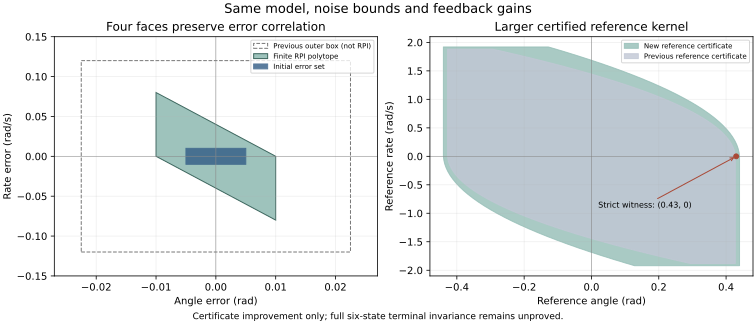

# 有限终端证书：姿态多面体的类内最小性与联合闭合接口

日期：2026-09-11。承接 [04 共同控制前驱](04_coupled_predecessor_and_finite_horizon.md)。

**本轮完成一个可有限存储、逐项核对的终端构件：四面姿态误差多面体。** 在同一模型、测量误差和反馈增益下，它给出更紧的误差/扭矩界，并严格扩大所采用的参考核与参考动作证书。还给出将六维输出反馈终端问题转成有限增广集合包含证书的充分条件。

这里的“最小”只针对下文固定坐标变换后的原点对称独立矩形类；“严格扩大”只针对明确比较的参考证书。完整六维无限时域闭合、真实最优性能和神经网络独立优势仍未证明，没有恢复控制实现或训练。

## 1 原无穷集合构造留下的表示问题

03 用无穷轨道凸包与无穷扰动和构造了 $`\mathcal H\oplus\mathcal S`$，理论有效，但不等于已经给出有限运行表示。它的独立角坐标外包也不能直接当作不变集。04 已明确要求 SMF 保留相关约束，因此后续不能以无保证的矩形替换来绕过此问题。

下面保持原反馈不变：

```math
\tau_k=\mu_k-K(y_k^\angle-c_k),\qquad
K=[8/25,\ 4/25],
```

其中参考 $`c=(\psi,\rho)`$ 仍满足真实离散生成器，不得重置。角跟踪误差 $`e=(\phi-\psi,\omega-\rho)`$ 满足：

```math
e^+=Me+g_\eta\eta,\qquad
M=\begin{bmatrix}1&1/50\\-8/25&21/25\end{bmatrix},
\quad g_\eta=\begin{bmatrix}0\\1\end{bmatrix},
\quad |\eta|\leq\epsilon=\frac2{625}.
```

$`\eta=-(8/25)\nu_\phi-(4/25)\nu_\omega`$。在原两个区间约束下，它的像恰是整个 $`[-2/625,2/625]`$。不需要概率独立或时间独立；若实际噪声有额外相关性，该完整区间仍是安全外包，但以下必要性/最小性针对的是这个区间抽象。

## 2 定理 E：固定变换矩形类中的最小 RPI 多面体

### 2.1 保留误差相关性的坐标变换

令：

```math
q=Pe=\begin{bmatrix}e_\phi\\s\end{bmatrix},
\qquad s=e_\omega+4e_\phi,\qquad
P=\begin{bmatrix}1&0\\4&1\end{bmatrix}.
```

直接相乘得：

```math
PMP^{-1}=
\begin{bmatrix}23/25&1/50\\0&23/25\end{bmatrix}.
```

记 $`r=23/25,h=1/50`$，则：

```math
q_1^+=rq_1+hq_2,\qquad q_2^+=rq_2+\eta.
```

研究固定该变换下、原点对称的独立矩形：

```math
\mathcal R(a,b)=\{q:|q_1|\leq a,\ |q_2|\leq b\},\qquad a,b\geq0.
```

### 2.2 不变性的充要条件与最小解

由于 r、h 为正，矩形和噪声区间允许各自端点，两个坐标的准确最坏幅值分别是 $`ra+hb`$ 和 $`rb+\epsilon`$。因此：

```math
\mathcal R(a,b)\text{ 鲁棒正不变}
\quad\Longleftrightarrow\quad
ra+hb\leq a,\qquad rb+\epsilon\leq b.
```

这是对全部 q 和全部允许 η 的逐点结论。由此任何该类不变矩形都必须满足：

```math
b\geq\frac{\epsilon}{1-r}=\frac1{25},\qquad
a\geq\frac{hb}{1-r}\geq\frac1{100}.
```

取等号得到按集合包含关系最小的矩形。换回原误差坐标：

```math
\boxed{
\mathcal K_{\rm fin}=
\left\{e:
|e_\phi|\leq\frac1{100},\
|e_\omega+4e_\phi|\leq\frac1{25}
\right\}.}
```

**定理 E。** $`\mathcal K_{\rm fin}`$ 对原误差递推鲁棒正不变；它在集合类 $`\{P^{-1}\mathcal R(a,b)\}`$ 中按包含关系最小，并且包含原初始角误差集合。

**证明。** 上述两条不等式是充要条件，取最小 a、b 时恰成立。对初始 $`|e_\phi|\leq0.005,|e_\omega|\leq0.01`$，有 $`|s|\leq0.01+4(0.005)=0.03<0.04`$，且 $`0.005<0.01`$，所以初始包含成立。证毕。

本定理不是所有凸集或所有多面体中的全局最小 RPI 结论。$`\mathcal K_{\rm fin}`$ 与旧真实 $`\mathcal H\oplus\mathcal S`$ 之间的包含关系也没有在此证明；不能由旧外包半径较大就推断真实集合嵌套。

## 3 四条面约束与精确非负乘子证书

写成有限多面体：

```math
H=
\begin{bmatrix}
1&0\\-1&0\\4&1\\-4&-1
\end{bmatrix},\qquad
d=
\begin{bmatrix}1/100\\1/100\\1/25\\1/25\end{bmatrix},
\qquad \mathcal K_{\rm fin}=\{e:He\leq d\}.
```

取：

```math
\Lambda=
\begin{bmatrix}
r&0&h&0\\
0&r&0&h\\
0&0&r&0\\
0&0&0&r
\end{bmatrix}\geq0.
```

逐项核对得到：

```math
HM=\Lambda H,\qquad
\Lambda d+|Hg_\eta|\epsilon=d.
```

因而对任意 $`He\leq d,|\eta|\leq\epsilon`$：

```math
H(Me+g_\eta\eta)
\leq\Lambda He+|Hg_\eta|\epsilon
\leq\Lambda d+|Hg_\eta|\epsilon=d.
```

这是一份有限有理数包含证书，不必截断无穷级数。四个面余量恰为零不表示失败：扰动使最小矩形的边界约束恰好达到等号。它也不等于闭环对原点渐近收敛；持续有界噪声下这里只证明集合不变性。

[certificate.json](../../results/theory_terminal_polytope_20260911/certificate.json) 保存了 M、H、d、噪声矩阵和完整 Λ，可脱离绘图直接逐项核对。

## 4 更紧的误差界与参考证书严格扩张

### 4.1 准确支持界

由 $`e_\omega=s-4e_\phi`$：

```math
|e_\phi|\leq0.01,\qquad |e_\omega|\leq0.04+4(0.01)=0.08.
```

实际力矩校正应直接在相关坐标上计算：

```math
\tau-\mu
=-0.32e_\phi-0.16e_\omega+\eta
=0.32e_\phi-0.16s+\eta,
```

```math
|\tau-\mu|\leq0.32(0.01)+0.16(0.04)+0.0032
=\frac8{625}=0.0128.
```

此值是在该矩形与完整噪声区间上的准确极值，可由顶点同时达到；不声称该顶点一定来自原初始集合的真实可达轨迹。对同一矩形类，上式关于 a、b 单调，因此所选最小矩形也最小化这个校正支持界。

| 同一误差递推的证书 | 角度误差界 | 角速率误差界 | 力矩校正界 |
|---|---:|---:|---:|
| 03 的级数三角不等式外包 | 0.0225 rad | 0.12 rad/s | 0.0296 N·m |
| 本文有限相关多面体 | 0.01 rad | 0.08 rad/s | 0.0128 N·m |

这是证明与表示的改进，控制增益未改变。

### 4.2 新参考核及可执行动作

收紧原角度、角速率、力矩约束，得到：

```math
|\psi|\leq0.44,\qquad |\rho|\leq1.92,\qquad
|\mu|\leq0.0672.
```

先证明未饱和误差律的不变性，再用 $`|\tau|\leq|\mu|+0.0128\leq0.08`$ 证明实际不会需要饱和；不能先假设饱和后仍具有同一个 M。

记 03 中精确离散制动距离为 $`S_h(s;b)`$，新参考最大制动加速度为 $`0.0672/J=3.36`$。定义：

```math
\mathcal C_{\rm new}=
\left\{(\psi,\rho):
|\rho|\leq1.92,\
\psi+S_h((\rho)_+;3.36)\leq0.44,\
-\psi+S_h((-\rho)_+;3.36)\leq0.44
\right\}.
```

最大刹停步数 $`\lceil1.92/0.0672\rceil=29`$，所以该核只有有限个面：对 $`n=0,\ldots,29`$，

```math
\psi+hn\rho\leq0.44+\frac{h^2(3.36)}2n(n-1),\qquad
-\psi-hn\rho\leq0.44+\frac{h^2(3.36)}2n(n-1),
```

另加角速率上下界。准确的参考动作集是：

```math
\mathcal A_{\rm new}(c)=
\left\{\mu:|\mu|\leq0.0672,\
(\psi+h\rho,\rho+\mu)\in\mathcal C_{\rm new}\right\}.
```

每个核内 c 都有非空动作集，最大制动并在最后一步恰好停止给出见证。仅满足 μ 幅值限制不能保证参考永久安全。

### 4.3 定理 F：所比较参考证书严格扩大

旧核使用位置半宽 0.4275、速率限值 1.88、制动加速度 2.52。更大的制动能力不能增加最小外向停止距离，而新位置/速率界也更宽。因此：

```math
\mathcal C_{\rm old}\subsetneq\mathcal C_{\rm new}.
```

严格见证是 $`c=(0.43,0)`$：属于新核，但违反旧核的零速角度限值。

对于共同参考状态 $`c\in\mathcal C_{\rm old}`$，任一旧动作既满足新幅值限制，其后继又属于 $`\mathcal C_{\rm old}\subset\mathcal C_{\rm new}`$，故：

```math
\mathcal A_{\rm old}(c)\subseteq\mathcal A_{\rm new}(c).
```

在共同状态 $`c=(0,0)`$，取 $`\mu=0.06`$。后继参考为 $`(0,0.06)`$，新制动距离 $`S_h(0.06;3.36)=0.0012<0.44`$，因此该动作被新证书接受；旧幅值上限 0.0504 排除它。动作包含在此严格。

这些严格见证不证明真实最大安全控制集合、实际轨迹性能或最优 MPC 代价严格改善。它们也不证明这些新参考总能与平移约束相容。



图中旧角矩形只是旧外包，不是 RPI 集；参考核则按各自解析面绘制。图形不用于接受证书。

## 5 接入 SMF 及同一有限动作的界改进

参考 c 已知时，只需保留以下四条线性不等式：

```math
|\phi-\psi|\leq0.01,\qquad
|(\omega-\rho)+4(\phi-\psi)|\leq0.04.
```

例如在约束 zonotope 的状态参数化 $`x=c_X+G_X\xi`$ 下，直接代入即可形成关于 ξ 的线性约束。不要丢掉关联项 $`4(\phi-\psi)`$ 后仍声称独立角矩形不变。

若 B 是同一历史下的可靠估计外包，且实际输入与参考始终遵循已证反馈，则：

```math
x_k\in B_k\cap\{x:(\phi-\psi,\omega-\rho)\in\mathcal K_{\rm fin}\}
\subseteq B_k.
```

这条包含对任何可靠基线成立。严格收紧仍需在当前 B 中找到违反新增面的已验证成员，不能保证每次观测后都严格改善。所有基线都可以使用这一物理证书，不能计为学习独有收益。

将同一四面证书代入 04 的同一 40 步参考、同一推力和同一实际反馈，平移公式不变，仅替换已证角误差界，得到：

| 量 | 04 的统一上界 | 本文改进后的统一上界 |
|---|---:|---:|
| $`\lvert p_x\rvert`$ | 0.9157216 | 0.8774626 |
| $`\lvert p_z-2\rvert`$ | 0.82659438475 | 0.818320876 |
| $`\lvert v_x\rvert`$ | 2.52614 | 2.42804 |
| $`\lvert v_z\rvert`$ | 1.963062525 | 1.9418484 |
| $`\lvert\phi\rvert`$ | 0.2225 | 0.21 |
| $`\lvert\omega\rvert`$ | 0.62 | 0.58 |
| $`\lvert\tau\rvert`$ | 0.0546 | 0.0378 |

真实控制律没有变化，所以上表表示解析上界变紧，不是同一轨迹被控制得更好。首次出域归纳及所有扰动/测量量词沿用 04；有限时域仍是 0..40 tick。

## 6 六维终端族的有限充分证书接口

角集合已有有限表示；还需避免把“真实状态各自有输入”误当作“同一信息下可执行同一个输入”。可以用明确的控制器内部状态把这项义务直接纳入闭环证书。

### 6.1 增广闭环与因果性

选择一个明确、有限维的控制器状态 χ，包含所需观测器、内部参考和有限历史；实际控制必须为 $`u=\kappa_\sigma(\chi)`$。分析状态为 $`\xi=(x,\chi)`$，但运行控制器不得读取其中未知的真实 x。若用矩阵表达控制律，乘在未知真实状态上的直接系数必须为零。

本接口使用确定的内部更新 $`\chi_{k+1}=\Phi_e(\chi_k,u_k,y_{k+1})`$，其中 e 包含观测模式变化。当前 χ 应保存计算输入和参考更新所需的信息；不能在证明外任意改变更新规则。

对每个允许观测/缺测模式边 $`e:\sigma\to\sigma'`$，先从实际控制和更新时序推导真实增广映射。若建立了经证明的仿射外包：

```math
\xi^+\in
\operatorname{conv}\bigcup_{\ell=1}^{L_e}
\left\{A_{e\ell}\xi+b_{e\ell}+G_{e\ell}w:
|w|\leq\bar w_{e\ell}\right\},
```

则可用有限证书检查多面体模式族。这里外包必须覆盖全部相容过程误差、当前/下一测量误差、实际输入和非线性余项；不能将悬停 Jacobian 直接当作精确模型。所用域上的外包有效性也是证明义务。

准确量词为：对该模式边 e 的每个源点 $`\xi\in P_\sigma`$ 及全部相容扰动/观测误差，上式右侧使用同一个源点 ξ。凸包仅混合同一目标模式 $`\sigma'`$ 下的连续状态后继，不能丢掉不同离散模式的标签。只核对有限个非线性样本或顶点不能自动得到这一外包。

选：

```math
P_\sigma=\{\xi:H_\sigma\xi\leq d_\sigma\}.
```

还必须验证其真实状态投影在原 D 内，控制 $`\kappa_\sigma(\chi)`$ 满足原输入限制，并覆盖所有允许初始模式与初始测量诱导的增广初始状态。

输入约束须独立验证：$`\forall\xi=(x,\chi)\in P_\sigma,\ \kappa_\sigma(\chi)\in U`$。候选投影属于 D 并不自动保证输入合法。可先在候选域上证明外包，再证明后继包含；外包证明本身不能预先假定下一步已在目标集合中。

### 6.2 定理 G：非负乘子给出所有后继的有限包含证据

若对每个 e、ℓ，存在非负矩阵 $`\Lambda_{e\ell}`$ 满足：

```math
\Lambda_{e\ell}H_\sigma=H_{\sigma'}A_{e\ell},
```

```math
\Lambda_{e\ell}d_\sigma
+H_{\sigma'}b_{e\ell}
+|H_{\sigma'}G_{e\ell}|\bar w_{e\ell}
\leq d_{\sigma'},
```

则各个仿射外包的所有后继均属于 $`P_{\sigma'}`$。目标为凸集，因此它们的并集及凸包也包含在目标中。

**证明。** 对 $`H_\sigma\xi\leq d_\sigma`$，左乘非负 Λ 保持不等式方向，再对噪声盒取支持上界，即得到 $`H_{\sigma'}\xi^+\leq d_{\sigma'}`$。外包有效性传递到实际映射；结合所有初始状态包含和全部模式边，按时刻归纳。证毕。

这是充分证书。本文没有证明任意非线性可行控制器都能用这一类有限模式、多面体及仿射外包表示，也不保证其搜索问题可行或整体凸。只有在闭环矩阵、外包和法向已固定时，部分乘子检查/求解才是线性约束；与控制增益、集合形状联合合成通常会出现双线性关系。

第 3 节的具体 Λ 是该接口的一个已完成角子系统实例。不能将这个 2 维实例当成全部六维模式矩阵已经求出。

### 6.3 为什么增广证书能形成信息状态族

对给定内部状态 χ，定义切片：

```math
X_{P_\sigma}(\chi)=\{x:(x,\chi)\in P_\sigma\}.
```

同一 χ 的全部相容真实状态使用同一个 $`\kappa_\sigma(\chi)`$。每个相容下一测量经同一个已定义的更新规则得到对应的 χ⁺；上述全称后继证书使所有相容 $`(x^+,\chi^+)`$ 留在下一多面体。

因此，可以把可靠 SMF 集合与该切片相交并显式保留约束，形成信息状态族。若之后用可能越出切片的外包替换，就不能继承此信息状态保证。切片非空性在真实初始状态和允许后继上由真值包含维持，而不是任意假定所有 χ 都有非空切片。

跨出切片的外包仍可能包含真值，因而仍然可靠；它只是不能直接沿用本终端族证书。使用本证书的表示须保留或重新相交切片约束，这与笼统要求所有 SMF 都采用该表示不同。

当不变族用于 MPC 终端时，还需要入口信息状态位于该族、实际更新被预测分支覆盖，以及策略移位/终端附加控制的证明。不能把固定备用控制器的证书自动转移给任意 MPC 力矩。

### 6.4 下一步需要实际交付的证书数据

完整 P2/P5 仍缺：

1. 一个明确读取位置测量的因果内部状态 χ 及其逐模式更新。必须覆盖最长 15 步位置包间隔和启动期，参考不能重置。
2. 覆盖整个候选域的六维非线性增广后继外包，以及它的有效域/余项证明。
3. 每个允许观测模式边的 $`H_\sigma,d_\sigma,\Lambda_{e\ell}`$ 和输入/任务约束证明；验证所有允许初始测量形成的增广初始集合均被包含。
4. 终端入口与策略移位条件。只改善姿态裕度，不足以宣布六维可行。

本轮未通过这些剩余项，也没有通过训练或轨迹试验来替代它们。最小姿态矩形和参考扩张只是已完成的有限构件；学习收益继续作为单独阻断项。

## 7 复核工具与审查记录

[check_terminal_polytope.py](../../verification/check_terminal_polytope.py) 使用 Python Fraction 精确核对坐标变换、面恒等式、乘子非负性、包含不等式、初始集合、参考严格见证及 40 步界。它还确认错误乘子和过小矩形被拒绝。

```bash
python verification/check_terminal_polytope.py --output /tmp/terminal_polytope_certificate.json
```

输出路径须不存在。脚本复用 04 的冻结配置、解析基准哈希和旧证书核对；没有导入在线真值生成器、训练网络或运行闭环轨迹。通用 exact_inclusion 函数仅验证给定仿射多面体包含，不替使用者证明这些矩阵覆盖实际系统，也不代替因果性检查。

完整数据见 [certificate.json](../../results/theory_terminal_polytope_20260911/certificate.json)。对于第 2 节的类内必要性、第 4 节参考核包含，以及第 6 节信息状态推论，仍须检查正文论证；脚本不是自动定理证明器。

本轮沿用用户指定 Academic Research Skills 的反方审查：独立审查确认变换、类内最小性、准确扭矩支持界和参考严格见证；要求明确不能扩大为全局最小不变集、实际最优控制优势或神经优势。另对增广闭环的因果性、模式后继和切片接口进行审查。

RPI 与输出反馈 tube 的结合已有成熟工作，例如 [Lorenzetti 与 Pavone](https://arxiv.org/abs/1911.07360) 的线性输出反馈方案，以及 [Köhler 等](https://arxiv.org/abs/2105.03427) 的非线性在线估计界框架。本轮核查其原作者摘要页；本文具体四面证书与数值是当前模型的推导，不归为这些论文原结论，也不以基础多面体包含技巧宣称首创。

本文是 AI 辅助研究材料。已证结论、充分条件和未求出的六维实例分开报告，供作者与导师复核。
